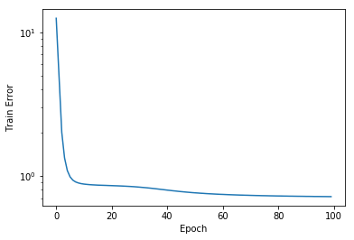

## 引入

**Matrix Factorisation**之类的模型将User和Item使用**隐向量**的方式表征, 通常使用点积的方式得到一个`(User, Item)`对的点击, 评分等情况. 在训练过程中, 根据**损失函数**, 将要训练的**隐向量**和**偏置**等参数经过计算, 得到与真实值的差距.

由于User和Item是用隐变量表征的, 每个都由一个单独的向量表示, 因此可以使用embedding的方式, 通过embedding lookup查找表示. 沿着这个思路, 使用交互数据进行训练(这使得整个训练过程类似于回归任务).

## 数据集

使用**Movielens-100k**数据集作为说明. 该数据集共有`943`个user和`1682`个item, 拥有`100k`的评分记录, 即大约有`7%`的`(User, Item)`对是有评分记录的, 所有的评分在`1-5`之间, 且为整数.

## 过程

首先读取数据集.

```python
dataset = pd.read_csv("./data/ml-100k/u.data", sep="\t", header=None, names=["user_id", "item_id", "rating", "timestamp"])
dataset.head()
```

```
    user_id	item_id	rating	timestamp
0	196	242	3	881250949
1	186	302	3	891717742
2	22	377	1	878887116
3	244	51	2	880606923
4	166	346	1	886397596
```

查看user和item的数量:

```python
len(dataset.user_id.unique()), len(dataset.item_id.unique())
```

```
(943, 1682)
```

为了保证所有user和item的索引是连续的, 并且从0开始, 使用`pandas.Series.cat`相关的方法进行转换:

```python
dataset.user_id = dataset.user_id.astype("category").cat.codes.values
dataset.item_id = dataset.item_id.astype("category").cat.codes.values
dataset.head()
```

```
	user_id	item_id	rating	timestamp
0	195	241	3	881250949
1	185	301	3	891717742
2	21	376	1	878887116
3	243	50	2	880606923
4	165	345	1	886397596
```

再将训练数据按80/20的比例分成训练集和开发集:

```python
from sklearn.model_selection import train_test_split
train, test = train_test_split(dataset, test_size=0.2)
```

**Matrix Factorisation**方法将user和item用定长的低维向量表示, 从而类似于**embedding**方法.

假设有$$M$$个user, $$N$$个item, 则行为矩阵就是一个$$A[M, N]$$的矩阵, 假设每个元素用$$k$$维的向量表征, 则user和item的**embedding矩阵**分别为$$W[M, k]$$和$$H[]N, k]$$. 最简单的MF训练方法为: $$A \approx W \cdot H^T$$.

下面开始使用`keras`解决MF训练的问题.

```python
from keras import backend as K
from keras.models import Model
from keras.layers import merge
from keras.layers import Input, Embedding, Flatten, Lambda

n_users, n_movies = len(dataset.user_id.unique()), len(dataset.item_id.unique())
n_latent_factors = 3

movie_input = Input(shape=[1],name="Item")
movie_embedding = Embedding(n_movies + 1, n_latent_factors, name="MovieEmbedding")(movie_input)
movie_vec = Flatten(name="FlattenMovies")(movie_embedding)

user_input = Input(shape=[1],name="User")
user_embedding = Embedding(n_users + 1, n_latent_factors,name="UserEmbedding")(user_input)
user_vec = Flatten(name="FlattenUsers")(user_embedding)

prod = merge.dot([movie_vec, user_vec], axes=-1)
model = Model([user_input, movie_input], prod)
model.compile("adam", "mean_squared_error")
model.summary()
```

```
__________________________________________________________________________________________________
Layer (type)                    Output Shape         Param #     Connected to                     
==================================================================================================
Item (InputLayer)               (None, 1)            0                                            
__________________________________________________________________________________________________
User (InputLayer)               (None, 1)            0                                            
__________________________________________________________________________________________________
MovieEmbedding (Embedding)      (None, 1, 3)         5049        Item[0][0]                       
__________________________________________________________________________________________________
UserEmbedding (Embedding)       (None, 1, 3)         2832        User[0][0]                       
__________________________________________________________________________________________________
FlattenMovies (Flatten)         (None, 3)            0           MovieEmbedding[0][0]             
__________________________________________________________________________________________________
FlattenUsers (Flatten)          (None, 3)            0           UserEmbedding[0][0]              
__________________________________________________________________________________________________
dot_1 (Dot)                     (None, 1)            0           FlattenMovies[0][0]              
                                                                 FlattenUsers[0][0]               
==================================================================================================
Total params: 7,881
Trainable params: 7,881
Non-trainable params: 0
__________________________________________________________________________________________________
```

训练模型:

```python
history = model.fit([train.user_id, train.item_id], train.rating, epochs=100)
```

```
Epoch 1/100
80000/80000 [==============================] - 10s 127us/step - loss: 12.5113
Epoch 2/100
80000/80000 [==============================] - 7s 84us/step - loss: 5.0213
Epoch 3/100
80000/80000 [==============================] - 6s 71us/step - loss: 2.0125
Epoch 4/100
80000/80000 [==============================] - 6s 70us/step - loss: 1.3367
Epoch 5/100
80000/80000 [==============================] - 6s 71us/step - loss: 1.0908
Epoch 6/100
80000/80000 [==============================] - 6s 72us/step - loss: 0.9856
......
Epoch 96/100
80000/80000 [==============================] - 6s 74us/step - loss: 0.7197
Epoch 97/100
80000/80000 [==============================] - 7s 83us/step - loss: 0.7193
Epoch 98/100
80000/80000 [==============================] - 6s 79us/step - loss: 0.7191
Epoch 99/100
80000/80000 [==============================] - 6s 74us/step - loss: 0.7186
Epoch 100/100
80000/80000 [==============================] - 6s 74us/step - loss: 0.7185
```

评估结果:

```python
pd.Series(history.history["loss"]).plot(logy=True)
plt.xlabel("Epoch")
plt.ylabel("Train Error")
```



```python
from sklearn.metrics import mean_absolute_error

y_hat = np.round(model.predict([test.user_id, test.item_id]),0)
y_true = test.rating
mean_absolute_error(y_true, y_hat)
```

```
0.6946
```

**获取隐向量**:

```python
movie_embedding_learnt = model.get_layer(name='MovieEmbedding').get_weights()[0]
pd.DataFrame(movie_embedding_learnt).head()
```

```
        0	        1	        2
0	0.851071	1.189640	1.343072
1	0.781866	0.685529	1.433414
2	0.993590	0.669892	1.075678
3	0.646283	1.750475	0.724367
4	0.888808	0.577949	1.447080
```

## 参考文章

- [Recommender Systems in Keras](https://nipunbatra.github.io/blog/2017/recommend-keras.html)
