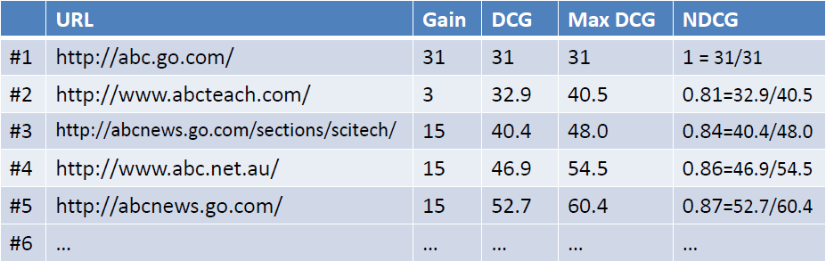

## 评价指标

在介绍具体的排序算法模型之前, 需要先了解评价排序模型的**指标**. 指标比较模型的输出结果和真实结果之间差异的大小. 排序中常用的衡量指标有:

- **NDCG**(Normalized Discounted Cumulative Gain)
- **MAP**(Mean Average Precision)

### NDCG

NDCG是用来衡量排序质量的指标. 表示了从**第一位**Doc到**第K位**Doc的**归一化累积折扣信息增益值**, 基本的思想是:

- 每条结果的相关性分等级来衡量; 考虑结果所在的位置, 位置越靠前的则重要程度越高
- 强相关文档比弱相关文档有用, 比不相关文档有用
- 相关等级高的结果位置越靠前则值应该越高, 否则给予惩罚

NDCG公式如下, 可以被拆为N, D, C, G四个部分分开来看:

---

首先看其中的一部分, CG(Cumulative Gain)指标:

$$CG_p = \sum\limits_{i=1}^{p} \text{relative}_i$$

公式的意思是一次搜索结果, 在P位置处(从第一开始向下计数)的CG值为之前所有位置**相关程度的累加**, $$\text{relative}_i$$表示$$i$$位置处的Doc与Query的相关性. 计算示例如下图, 其中的`Gain`列就表示此URL与Query的相关性.

CG指标的一个弊端就是: 改变搜索结果的位置顺序不会影响p的CG值. 也就是说, 移动一个相关性高的文档到一个排名但相关性不大的文档上面不改变CG的值, 体现不出排名的优劣性.

---

DCG(Discounted Cumulative Gain)指标是取代CG的一个更准确的测量方法, DCG指标认为, 如果一个强相关的文档排名靠后则应该受到惩罚, 位置$$p$$处的DCG值应当为:

$$DCG_p = \text{relative}_1 + \sum\limits_{i=2}^{p} \frac{\text{relative}_i}{\log_2 i}$$

或者另一个更强调相关性的DCG公式(若分级相关度只在0和1取二值的话, 二公式效果相同):

$$DCG_p = \sum\limits_{i=1}^{p} \frac{2^{\text{relative}_i} - 1}{\log_2(1 + i)}$$

---

NDCG(Normalized Discounted Cumulative Gain)

不同的Query, 产生的结果列表的长度也不相同, NDCG考虑到了度量归一化的问题. 为了使不同长度的搜索结果的DCG值能够进行比较, 使用**IDCGp**(Ideal DCG), 即在当前$$p$$位置, 按照相关性大小产生的完美的排序下, p所具有的最大DCG值:

$$NDCG_p = \frac{DCG_p}{IDCG_P}$$

例子如下:

这样一来无论Query产生的结果长度如何, NDCG指标都可以得到一个平均值, 在不同长度的Query产生的结果之间, 也能够做比较了.

NDCG的取值在0到1之间, 完美排序会使NDCG能够取值为1, 值越大越好.

---

**参考资料**

- [Learning to Rank for IR的评价指标—MAP,NDCG,MRR](https://www.cnblogs.com/eyeszjwang/articles/2368087.html)
- [nDCG学习笔记](http://www.cnblogs.com/lixiaolun/p/4050967.html)
- [记录了多种应用于LTR算法评价指标的Python实现](https://gist.github.com/bwhite/3726239)

### MAP

MAP(Mean Average Precision)求每个相关文档检索出后的**准确率的平均值**的**算术平均值**, 这里对准确率求了两次平均, 因此称为Mean Average Precision.

在MAP中, Query-Doc对的相关性判断只有两档, 0或1. 对于一个Query, 其AP值(准确率的平均值)为:

$$
\begin{aligned}
AP_i = \frac{\sum\limits_{j=1}^{n_i}P(j) \cdot y_{i,j}}{\sum\limits_{j=1}^{n_i}\cdot y_{i,j}}
\end{aligned}
$$

$$i$$表示第$$i$$个Query, $$n_i$$是这个Query中结果的总数量; $$y_{ij}$$即这个Query-Doc对的**label**, 0或1.

$$P$$值代表了到$$d_{ij}$$这个Doc为止的**准确率**:

$$
\begin{aligned}
P(j) = \frac{\sum\limits_{k:\pi_i(k)\le\pi_i(j)}y_{i,k}}{\pi_i(j)}
\end{aligned}
$$

$$\pi_i(j)$$是Doc $$d_{ij}$$在排序中的位置.

然后再对所有Query计算平均值得到最后的AP值.

---

**参考资料**:

- [Learning to Rank简介](http://www.cnblogs.com/bentuwuying/p/6681943.html)
