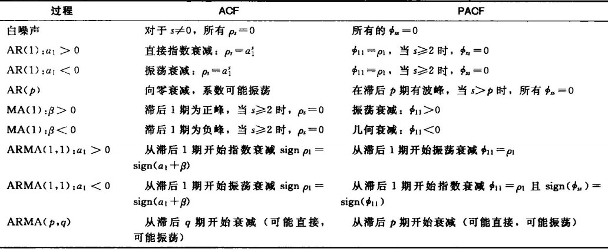
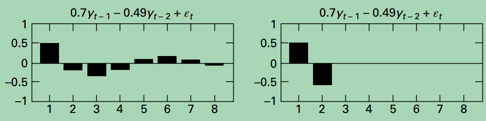
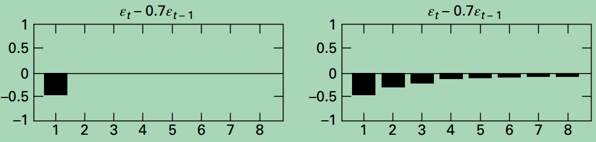
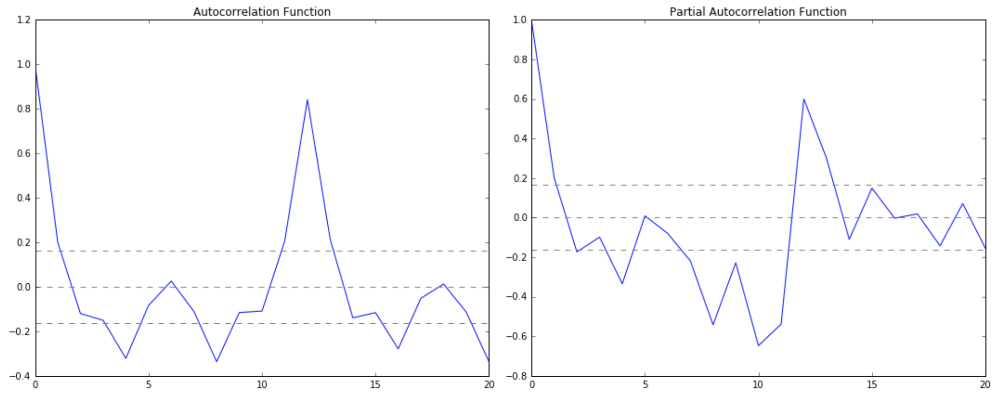

## ACF

**Autocorrelation Function, ACF, 自相关函数**, 是将一个时间序列, 与将其滞后若干个时间间隔的版本, 计算**相关系数**. 其实**相关系数**与**协方差**都是用来衡量相关性大小的, 只是相关系数消除了**量纲**的影响, 使得所有的数据有了统一个衡量标准.

如`ACF(5)`就是将时间序列与滞后5个时间间隔版本的时间序列, 计算得到的相关系数的标量:

$$\rho_{xy}=\frac{Cov(r_t,r_{t-l})}{\sqrt{Var(r_t)Var(r_{t-l})}}=\frac{Cov(r_t,r_{t-l})}{Var(r_t)}$$

上式分母的变换使用到了, **平稳序列**的方差是恒定值的性质.

在`Python`中使用ACF如下:

```python
from statsmodels.tsa.stattools import acf
```

## PACF

**Partial Autocorrelation Function, PACF, 偏自相关函数**, 对于PACF(k), 衡量的是$$X_{t-k}$$对$$X_t$$的相关程度的度量. 其本质还是当前的时间序列与滞后版本时间序列的相关系数的度量, 但是消除了夹在两者之间的$$X_{t-k+1},\cdots,X_{t-1}$$等随机变量的影响之后, 得到的结果.

在`Python`中使用PACF如下:

```python
from statsmodels.tsa.stattools import pacf
```

## ACF/PACF与ARIMA模型

可以使用ACF图与PACF图, 主观判断ARIMA模型中p和q参数的值应该是多少. ACF图与PACF图的横坐标是滞后的时间间隔的数量$$1,2,\cdots$$, 纵坐标是时间序列与当前横坐标对应的滞后版本的时间序列之间的相关系数, **值域在$$[-1, 1]$$**之间.

首先介绍**截断**与**拖尾**:

- **截断**: ACF图与PACF图, 在某个`lag`对应的横坐标之后, 所有值都为0(严格来说), 这种情况称为截断
- **拖尾**: ACF图与PACF图, 在某个`lag`对应的横坐标之后, 相关系数的绝对值随着横坐标的增大, 形成衰减或震荡的趋势, 但不会在某个值之后, 全部为0(严格)

**AR**模型和**MA**模型的ACF图与PACF图有着如下的性质:



即:

- **AR**模型的**ACF图拖尾**, **PACF图截断**:

  

- **MA**模型的**ACF图截断**, **PACF图拖尾**:

  

(原理未知.)

在实际中, 常使用如下的经验法则根据两图判断ARIMA模型对应的p和q值:



- **p值**: **PACF图**首次下穿**置信区间的上界**对应的`lag`, 此例中对应`p=2`

- **q值**: **ACF图**首次下穿**置信区间的上界**对应的`lag`, 此例中对应`q=2`

这里出现的置信区间, 就是两个时间序列得到的**相关系数的均值**这个**统计量**的置信区间. 相关系数均值这个统计量的是符合**正态分布**, 因此可以使用$$z$$统计量来和置信水平$$1-\alpha$$来确定置信区间. 又由于我们认为相关系数为0时, 两个序列之间没有相关关系, 因此就形成了以0轴为中心的置信区间.

我们认为如果**相关系数**为0, 则不存在相关性. 而相关系数是符合**标准正态分布**的统计量, 即$$N(0,1)$$. 对于显著性水平$$\alpha=0.05$$, 对应的$$z_{\alpha/2}=1.96$$.

这是考虑其中某一个相关系数, 如果考虑多个相关系数, 即考虑每个`lag`对应的相关系的**平均水平**, 就变成了**相关系数均值**统计量的情况. 很显然, 这个均值仍服从期望为0的正态分布, 但此时的方差变为了$$\frac{1}{n}$$, $$n$$为样本量的数量, 从而`95%`置信水平对应的置信区间变为了$$[-1.96/\sqrt{n}, 1.96/\sqrt{n}]$$
