```python
import numpy as np
import pandas as pd
import matplotlib.pyplot as plt
%matplotlib inline
```


```python
from matplotlib.pylab import rcParams
rcParams['figure.figsize'] = (15, 6)
```

### 读取数据

将代表日期的列, 作为index, 并根据日期的格式转换为`DatetimeIndex`格式, 这样在后续的操作中很方便.


```python
data = pd.read_csv("AirPassengers.csv", index_col="Month", date_parser=lambda x: pd.datetime.strptime(x, "%Y-%m"))
data.head()
```

<table border="1" class="dataframe">
  <thead>
    <tr style="text-align: right;">
      <th></th>
      <th>#Passengers</th>
    </tr>
    <tr>
      <th>Month</th>
      <th></th>
    </tr>
  </thead>
  <tbody>
    <tr>
      <th>1949-01-01</th>
      <td>112</td>
    </tr>
    <tr>
      <th>1949-02-01</th>
      <td>118</td>
    </tr>
    <tr>
      <th>1949-03-01</th>
      <td>132</td>
    </tr>
    <tr>
      <th>1949-04-01</th>
      <td>129</td>
    </tr>
    <tr>
      <th>1949-05-01</th>
      <td>121</td>
    </tr>
  </tbody>
</table>

```python
data.index
```


    DatetimeIndex(['1949-01-01', '1949-02-01', '1949-03-01', '1949-04-01',
                   '1949-05-01', '1949-06-01', '1949-07-01', '1949-08-01',
                   '1949-09-01', '1949-10-01',
                   ...
                   '1960-03-01', '1960-04-01', '1960-05-01', '1960-06-01',
                   '1960-07-01', '1960-08-01', '1960-09-01', '1960-10-01',
                   '1960-11-01', '1960-12-01'],
                  dtype='datetime64[ns]', name='Month', length=144, freq=None)


```python
data = data["#Passengers"]
```

### 画图分析


```python
plt.plot(data)
```


    [<matplotlib.lines.Line2D at 0x1761c5d0860>]


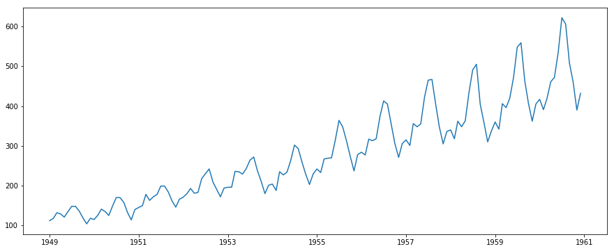


可以看出两点:

- 有很强的趋势性, 因此肯定不是平稳序列, 需要进行转换处理, 成为平稳序列
- 有季节性

### 检测平稳性

因为后面要多次使用, 所以封装成一个函数


```python
from statsmodels.tsa.stattools import adfuller
```


```python
def test_stationarity(ts, window=12):
    rolling_mean = ts.rolling(window=window).mean()
    rolling_std = ts.rolling(window=window).std()
    
    plt.plot(ts, color='blue',label='Original')
    plt.plot(rolling_mean, color='red', label='Rolling Mean')
    plt.plot(rolling_std, color='black', label = 'Rolling Std')
    plt.legend(loc='best')
    plt.title('Rolling Mean & Standard Deviation')
    
    adf_result = adfuller(ts, autolag="AIC")
    pd_result = pd.Series(adf_result[:4], index=['Test Statistic','p-value','#Lags Used','Number of Observations Used'])
    pd_result = pd.concat([pd_result, pd.Series(adf_result[4])])
    return pd_result
```

`adfuller`函数返回6个值, 分别代表:
- adf : float
    - Test statistic
- pvalue : float
    - MacKinnon's approximate p-value based on MacKinnon (1994, 2010)
- usedlag : int
    - Number of lags used
- nobs : int
    - Number of observations used for the ADF regression and calculation of the critical values
- critical values : dict
    - Critical values for the test statistic at the 1 %, 5 %, and 10 % levels. Based on MacKinnon (2010)
- icbest : float
    - The maximized information criterion if autolag is not None.


```python
test_stationarity(data)
```


    Test Statistic                   0.815369
    p-value                          0.991880
    #Lags Used                      13.000000
    Number of Observations Used    130.000000
    1%                              -3.481682
    5%                              -2.884042
    10%                             -2.578770
    dtype: float64


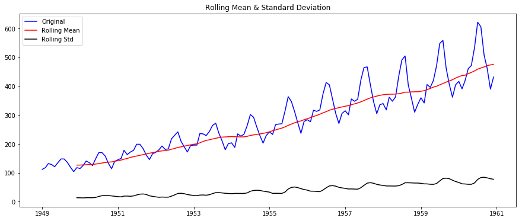


单位根检验的结果是不平稳的, 因此要把这个非平稳序列, 转换成平稳序列

### 转换为平稳序列

- 首先通过**转换函数**, 如$$log$$函数来转换, 缩小值域中的差距


```python
ts = data.copy()
ts_log = np.log(ts)
plt.plot(ts_log)
```


    [<matplotlib.lines.Line2D at 0x17621806b38>]


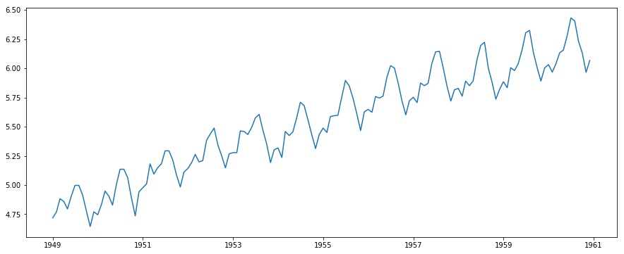


- 通过**移动平均**的方法进行平滑, 得到趋势, 然后在原有的序列中移除趋势.

这时因为趋势是造成时间序列不平稳的一个重要因素


```python
moving_avg = ts_log.rolling(window=12).mean()
plt.plot(ts_log)
plt.plot(moving_avg, color="red")
```


    [<matplotlib.lines.Line2D at 0x176217b68d0>]


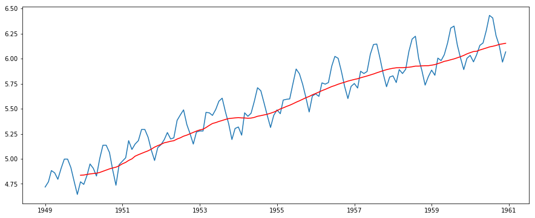


```python
ts_log_ma_diff = ts_log - moving_avg
ts_log_ma_diff.head(15)
```


    Month
    1949-01-01         NaN
    1949-02-01         NaN
    1949-03-01         NaN
    1949-04-01         NaN
    1949-05-01         NaN
    1949-06-01         NaN
    1949-07-01         NaN
    1949-08-01         NaN
    1949-09-01         NaN
    1949-10-01         NaN
    1949-11-01         NaN
    1949-12-01   -0.065494
    1950-01-01   -0.093449
    1950-02-01   -0.007566
    1950-03-01    0.099416
    Name: #Passengers, dtype: float64


因为我们使用了时间作为索引, 所以可以直接相减, 而不用人工进行对齐, 从而大大方便了操作.

之后抛弃掉这些为空的时间点. 因此使用这种方法抛弃趋势, 会造成**样本的损失**, 损失数量与求移动平均时的窗口大小有关.


```python
ts_log_ma_diff.dropna(inplace=True)
test_stationarity(ts_log_ma_diff)
```


    Test Statistic                  -3.162908
    p-value                          0.022235
    #Lags Used                      13.000000
    Number of Observations Used    119.000000
    1%                              -3.486535
    5%                              -2.886151
    10%                             -2.579896
    dtype: float64


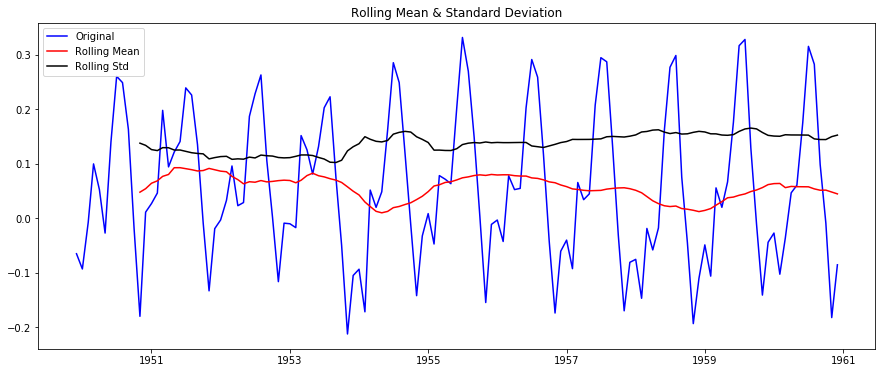


也可以使用带权值的平均方法, 这样就不会造成样本的损失了, 如EWMA等.


```python
exp_weighted_avg = ts_log.ewm(halflife=12).mean()
plt.plot(ts_log)
plt.plot(exp_weighted_avg, color="red")
```


    [<matplotlib.lines.Line2D at 0x17621a45eb8>]


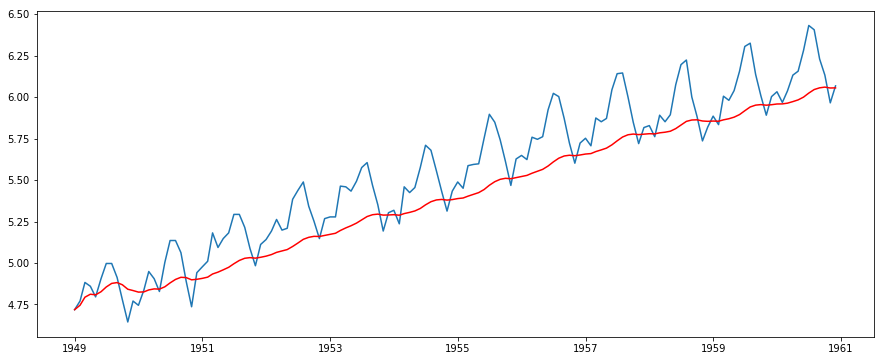


```python
ts_log_ewma_diff = ts_log - exp_weighted_avg
test_stationarity(ts_log_ewma_diff)
```


    Test Statistic                  -3.601262
    p-value                          0.005737
    #Lags Used                      13.000000
    Number of Observations Used    130.000000
    1%                              -3.481682
    5%                              -2.884042
    10%                             -2.578770
    dtype: float64


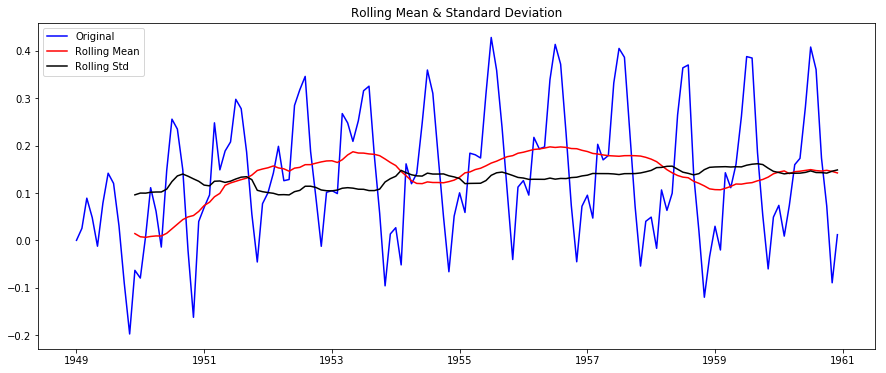


使用**EWMA**方法得到的序列, 单位根检验得到P值只有0.0057, 小于1%, 因此是平稳的.

- 使用差分

当然, 差分也会造成样本点的损失, 损失的数量为差分的阶数.

首先进行**一阶差分**:


```python
ts_log_diff = ts_log.diff()
ts_log_diff.dropna(inplace=True)
plt.plot(ts_log_diff)
```


    [<matplotlib.lines.Line2D at 0x17621af0c88>]


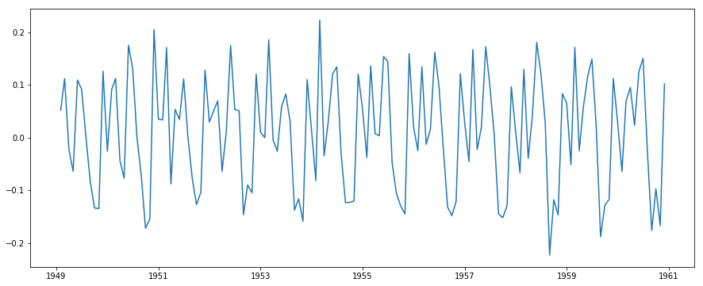


```python
test_stationarity(ts_log_diff)
```


    Test Statistic                  -2.717131
    p-value                          0.071121
    #Lags Used                      14.000000
    Number of Observations Used    128.000000
    1%                              -3.482501
    5%                              -2.884398
    10%                             -2.578960
    dtype: float64


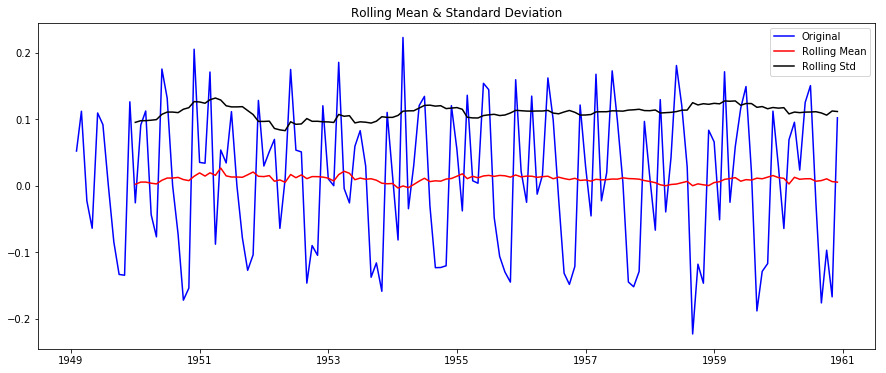


看出, 如果以5%的显著性水平来判断, 此时的序列仍然是不平稳的.

再进行一次差分, 即使用**二阶差分**, 方法就是对一阶差分得到的序列再次进行差分. 更高阶的差分依次类推.


```python
ts_log_diff2 = ts_log_diff.diff()
ts_log_diff2.dropna(inplace=True)
plt.plot(ts_log_diff2)
```


    [<matplotlib.lines.Line2D at 0x17622463dd8>]


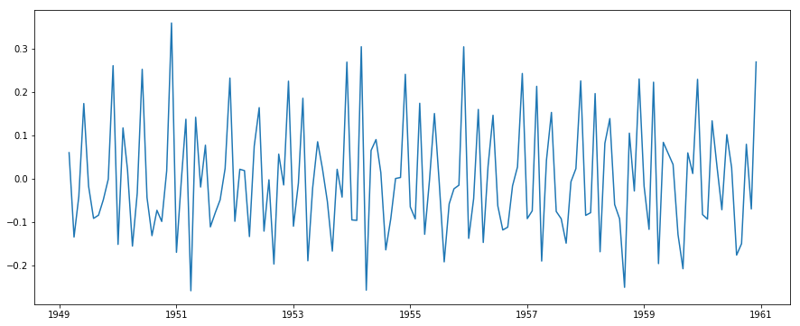


```python
test_stationarity(ts_log_diff2)
```


    Test Statistic                -8.196629e+00
    p-value                        7.419305e-13
    #Lags Used                     1.300000e+01
    Number of Observations Used    1.280000e+02
    1%                            -3.482501e+00
    5%                            -2.884398e+00
    10%                           -2.578960e+00
    dtype: float64


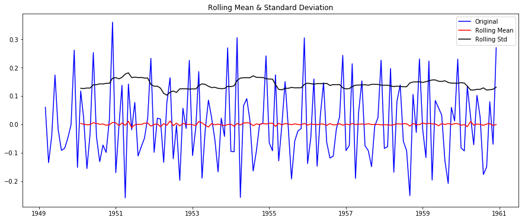


现在的效果就非常好了.

- 分解方法

对时间序列进行分解, 分解成**趋势**, **季节性**, **残差**三部分, 剩余的残差部分就是我们需要继续分析建模的.


```python
from statsmodels.tsa.seasonal import seasonal_decompose
```


```python
decomposition = seasonal_decompose(ts_log)
decomposition
```


    <statsmodels.tsa.seasonal.DecomposeResult at 0x17621aaefd0>


```python
trend = decomposition.trend
seasonal = decomposition.seasonal
residual = decomposition.resid
```


```python
plt.subplot(411)
plt.plot(ts_log, label='Original')
plt.legend(loc='best')
plt.subplot(412)
plt.plot(trend, label='Trend')
plt.legend(loc='best')
plt.subplot(413)
plt.plot(seasonal,label='Seasonality')
plt.legend(loc='best')
plt.subplot(414)
plt.plot(residual, label='Residuals')
plt.legend(loc='best')
plt.tight_layout()
```


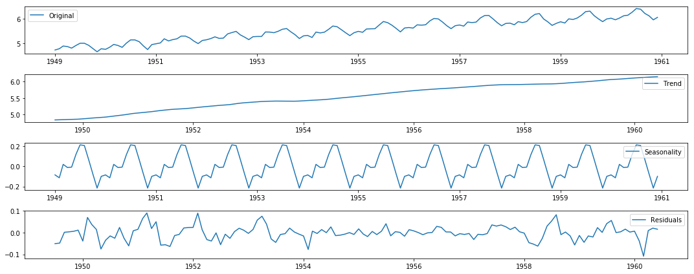


```python
ts_log_decompose = residual
ts_log_decompose.dropna(inplace=True)
plt.plot(ts_log_decompose)
```


    [<matplotlib.lines.Line2D at 0x176219d4780>]


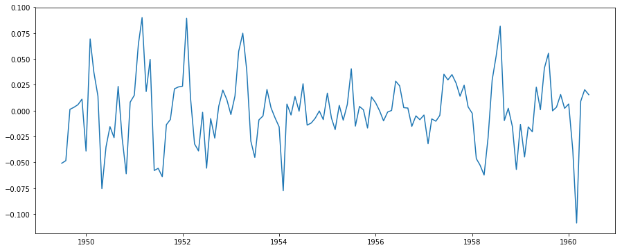


```python
test_stationarity(ts_log_decompose)
```


    Test Statistic                -6.332387e+00
    p-value                        2.885059e-08
    #Lags Used                     9.000000e+00
    Number of Observations Used    1.220000e+02
    1%                            -3.485122e+00
    5%                            -2.885538e+00
    10%                           -2.579569e+00
    dtype: float64


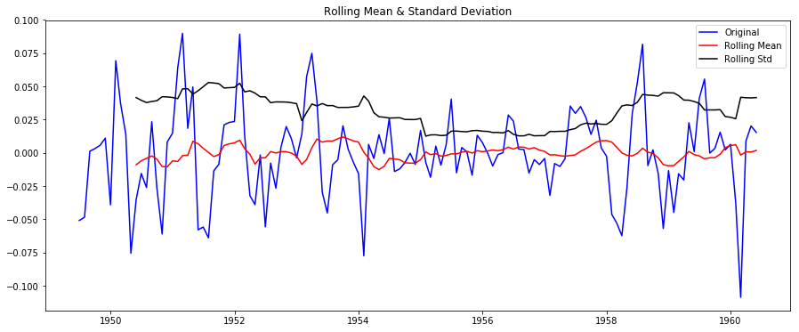


### 使用ARIMA模型拟合时间序列

对平稳的时间序列进行拟合.

为了确定模型的`p`, `q`参数, 需要观察**ACF**和**PACF**图.

使用二阶差分得到的平稳的时间序列进行建模.


```python
from statsmodels.tsa.stattools import acf, pacf
```


```python
lag_acf = acf(ts_log_diff2, nlags=20, qstat=True)
lag_pacf = pacf(ts_log_diff, nlags=20, method='ols')
```

`nlags`参数指的是最多计算到滞后多少的相关系数.

如果将`acf`函数的`qstat`设为`True`, 会对每个得到的每个`lag`对应的**acf值**进行**Ljung-Box检验**, 得到其中的**Q-Statistic**与对应的**p值**


```python
lag_acf
```


    (array([ 1.        , -0.29259645, -0.18169949,  0.09178998, -0.26513649,
             0.0744176 ,  0.15706545,  0.06091289, -0.28217623,  0.13570859,
            -0.19321736, -0.20189909,  0.78671457, -0.16248543, -0.23423377,
             0.11972506, -0.25648661,  0.09835277,  0.12316422,  0.06351573,
            -0.27928986]),
     array([ 12.41566087,  17.23769411,  18.47713708,  28.89337204,
             29.7199457 ,  33.42908605,  33.99108501,  46.14138197,
             48.97286459,  54.75607791,  61.11887786, 158.47020324,
            162.65515037, 171.41990724, 173.72780875, 184.4038359 ,
            185.98622757, 188.48771478, 189.15838387, 202.23216863]),
     array([4.25748319e-04, 1.80668436e-04, 3.50620402e-04, 8.21711373e-06,
            1.67435636e-05, 8.66917700e-06, 1.72909183e-05, 2.23432051e-07,
            1.67937141e-07, 3.50725723e-08, 5.74168310e-09, 1.07637782e-27,
            5.71449852e-28, 3.53683298e-29, 4.35673666e-29, 1.10115181e-30,
            1.84448792e-30, 1.98146353e-30, 4.81770436e-30, 4.06908408e-32]))


```python
plt.subplot(121)
plt.plot(lag_acf[0])
plt.axhline(y=0,linestyle='--',color='gray')
plt.axhline(y=-1.96/np.sqrt(len(ts_log_diff2)),linestyle='--',color='gray')
plt.axhline(y=1.96/np.sqrt(len(ts_log_diff2)),linestyle='--',color='gray')
plt.title('Autocorrelation Function')

plt.subplot(122)
plt.plot(lag_pacf)
plt.axhline(y=0,linestyle='--',color='gray')
plt.axhline(y=-1.96/np.sqrt(len(ts_log_diff2)),linestyle='--',color='gray')
plt.axhline(y=1.96/np.sqrt(len(ts_log_diff2)),linestyle='--',color='gray')
plt.title('Partial Autocorrelation Function')
plt.tight_layout()
```


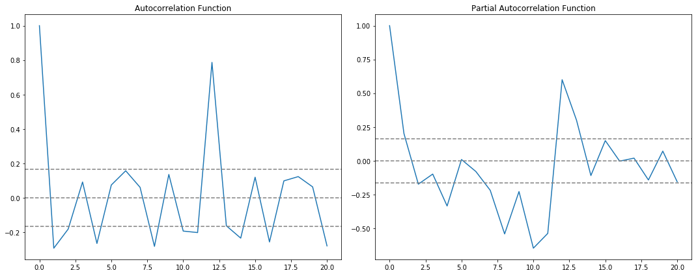


需要注意的是这条虚线, 这是用来判断**ARIMA**模型的`p`和`q`参数的工具. 判断的原理为:

我们认为如果**相关系数**为0, 则不存在相关性. 而相关系数是符合**标准正态分布**的统计量, 即$$N(0,1)$$. 对于显著性水平$$\alpha=0.05$$, 对应的$$z_{\alpha/2}=1.96$$.

这是考虑其中某一个相关系数, 如果考虑多个相关系数, 即考虑每个`lag`对应的相关系的**平均水平**, 就变成了**相关系数均值**统计量的情况. 很显然, 这个均值仍服从期望为0的正态分布, 但此时的方差变为了$$\frac{1}{n}$$, $$n$$为样本量的数量, 从而`95%`置信水平对应的置信区间变为了$$[-1.96/\sqrt{n}, 1.96/\sqrt{n}]$$

根据上面两幅图, 得到$$p=2$$, $$q=2$$.

### ARIMA模型拟合


```python
from statsmodels.tsa.arima_model import ARIMA
```


```python
model = ARIMA(ts_log, order=(2, 2, 2))
```


注意这里使用的还是原序列经过`log`转换后的序列.

这是因为, 我们确定了二阶差分的结果为稳定序列, 在ARIMA模型中可以指定$$d$$参数进行差分. 当然也可以使用**差分后**, 或者**其他方法处理后**得到的**平稳序列**进行建模, 这样在ARIMA模型中指定$$d$$参数为0就可以了.

**需要注意的是**: 如果使用处理后的平稳序列来建模, 需要考虑**如何将ARIMA模型拟合出来的结果序列, 以及预测序列进行还原**. 平滑, 分解, 差分等方法对应着不同的还原方法.

**直接将非平稳序列投入到ARIMA模型中, 使用提前确定好的能使序列平稳的差分阶数进行处理, 得到的拟合结果是差分之后的, 需要进行差分的还原才能投入到模型中的原始的非平稳时间序列进行对比.**


```python
results_ARIMA = model.fit(disp=-1)
results_ARIMA
```


    <statsmodels.tsa.arima_model.ARIMAResultsWrapper at 0x17621cf0668>


```python
" | ".join([t for t in results_ARIMA.__dir__() if not t.startswith("_")])
```


    'aic | arfreq | arparams | arroots | bic | bse | conf_int | cov_params | data | df_model | df_resid | f_test | fittedvalues | forecast | hqic | initialize | k_ar | k_constant | k_diff | k_exog | k_ma | k_trend | llf | load | mafreq | maparams | maroots | mle_retvals | mle_settings | model | n_totobs | nobs | normalized_cov_params | params | plot_predict | predict | pvalues | remove_data | resid | save | scale | sigma2 | summary | summary2 | t_test | t_test_pairwise | tvalues | use_t | wald_test | wald_test_terms'


```python
print("AIC:", results_ARIMA.aic)
print("BIC:", results_ARIMA.bic)
print("Parameters:")
print(results_ARIMA.params)
```

    AIC: -230.4544919731087
    BIC: -212.71952962750115
    Parameters:
    const                  -0.000078
    ar.L1.D2.#Passengers   -0.579206
    ar.L2.D2.#Passengers    0.035827
    ma.L1.D2.#Passengers   -0.134602
    ma.L2.D2.#Passengers   -0.865398
    dtype: float64


```python
plt.plot(ts_log_diff2)
plt.plot(results_ARIMA.fittedvalues, color='red')
plt.title('RSS: %.4f'% sum((results_ARIMA.fittedvalues-ts_log_diff2)**2))
```


    Text(0.5,1,'RSS: 1.5016')


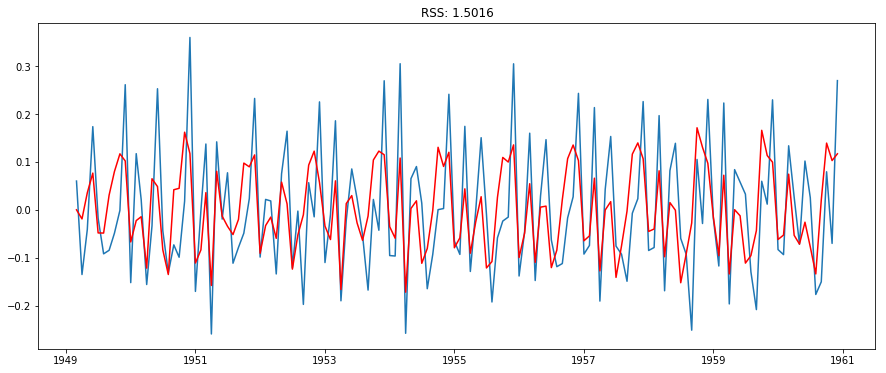


```python
results_ARIMA.plot_predict()
```


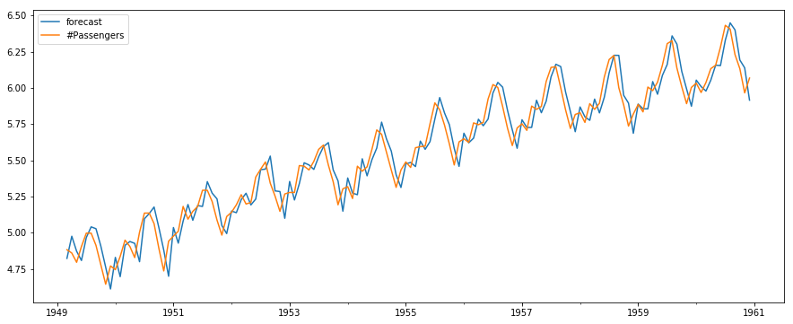


### 还原拟合序列

使用`predict`方法进行拟合结果的输出, 注意`typ`参数, 指定了两种输出的形式:

- linear: 输出差分后的结果, 结果与`.fittedvalues`一模一样
- levels: 输入原始的结果, 已经消除了差分之后的结果


```python
history_log_pred = results_ARIMA.predict(typ="levels")
history_org_pred = np.exp(history_log_pred)
plt.plot(ts[2:])
plt.plot(history_org_pred)
plt.title('RMSE: %.4f'% np.sqrt(sum((history_org_pred-ts[2:])**2)/len(ts)))
```


    Text(0.5,1,'RMSE: 31.2558')


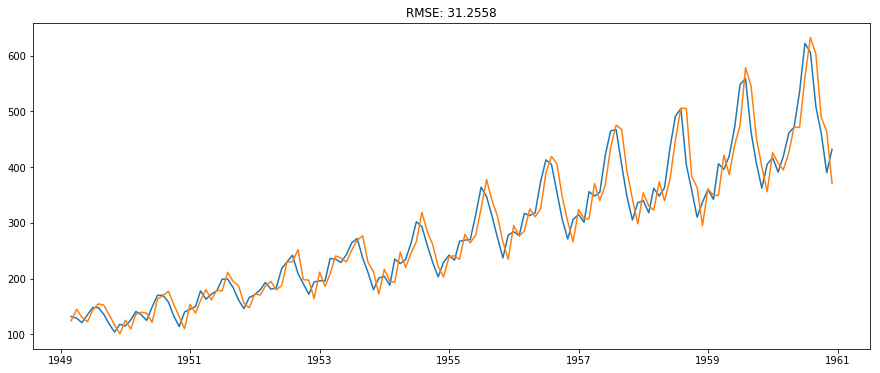


### 对未来进行预测

使用`forecast`方法对未来进行预测, 可以指定返回的未来时间点的数量.

返回三个值, 分别是:

- forecast : array
    - Array of out of sample forecasts
- stderr : array
    - Array of the standard error of the forecasts.
- conf_int : array
    - 2d array of the confidence interval for the forecast, 即每个预测点的置信区间


```python
results_ARIMA.forecast(12)
```


    (array([6.14101531, 6.10819661, 6.13524774, 6.12372575, 6.13657083,
            6.13380071, 6.14082833, 6.14150192, 6.14608714, 6.1480594 ,
            6.15156556, 6.15396998]),
     array([0.10127036, 0.16498959, 0.20231821, 0.23821591, 0.26685385,
            0.29415374, 0.31827347, 0.34119512, 0.3623683 , 0.38255293,
            0.40161437, 0.41987825]),
     array([[5.94252906, 6.33950156],
            [5.78482295, 6.43157028],
            [5.73871134, 6.53178414],
            [5.65683114, 6.59062036],
            [5.6135469 , 6.65959476],
            [5.55726998, 6.71033145],
            [5.51702379, 6.76463287],
            [5.47277176, 6.81023207],
            [5.43585832, 6.85631597],
            [5.39826943, 6.89784937],
            [5.36441585, 6.93871527],
            [5.33102373, 6.97691623]]))


```python
forecast_value = pd.Series(results_ARIMA.forecast(12)[0], index=[history_org_pred.index[-1] + i for i in range(1, 13)])
forecast_value.head()
```


    1961-01-01    6.141015
    1961-02-01    6.108197
    1961-03-01    6.135248
    1961-04-01    6.123726
    1961-05-01    6.136571
    dtype: float64


```python
plt.plot(ts[2:])
plt.plot(np.exp(pd.concat([history_log_pred, forecast_value])))
```


    [<matplotlib.lines.Line2D at 0x1761ec0e978>]


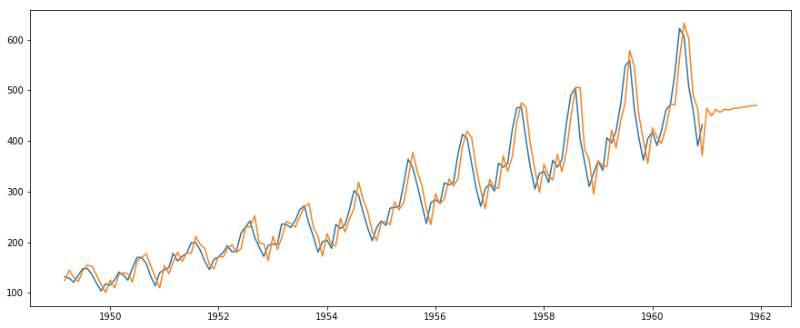


结果并不是很好.
