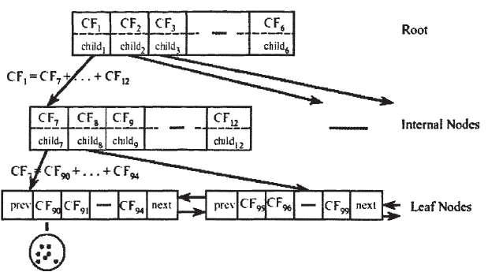

## BIRCH

**BIRCH**(Balanced Iterative Reducing and Clustering Using Hierarchies)算法是一种十分适合于**数据量大**, **类别数较多**的情况, 由于**单边扫描**就能够完成聚类, 复杂度为$$O(n)$$, 因此算法的速度很快.

除此之外, BIRCH能够识别出数据集中的**异常点**. 但不能自动地给出聚类最后类的数量.

## Clustering Feature

BIRCH使用到了**CF Tree**(Clustering Feature Tree)这种树型数据结构, 这棵树的每一个结点都是由若干个**聚类特征**(Clustering Feature, **CF**)组成. 每个结点(包括叶子结点)都有若干个CF, 而树的内部结点中的CF还有指向孩子结点的指针, 而所有的叶子结点使用一个双向链表连接起来, 整体结构如下图:

每一个CF都是一个**三元组**, 用(N,LS,SS)表示, 其中:

- **N**: CF中拥有的样本点的数量
- **LS**: CF中拥有的样本点各特征维度的和向量
- **SS**: CF中拥有的样本点各特征维度的平方和向量

CF有一个很好的性质, 即满足**可加性定理**: 对于两个完全没有交集的CF, 两者合并之后的三元组可以表示为:

$$CF_1+CF_2=(N_1+N_2,LS_1+LS_2,SS_1+SS_2)$$

因此, 对于每个CF结点, 它的(N,LS,SS)三元组的值等于这个CF结点所指向的**子节点**中的所有CF三元组之和, 这个在上图中也有体现.

下面开始从零开始根据数据集中依次输入的单个样本构建CF Tree. CF Tree的构建有三个重要的参数, 分别是:

- **B**: 树中每个**内部结点**包含的最大CF数量
- **L**: 每个**叶子结点**包含的最大CF数量
- **T**: **叶子结点**中每个CF的**最大样本半径**阈值, 即每个CF中所有的样本点要求在一个半径不大于T的超球体内.

## 构建CF Tree

CF Tree的构建步骤如下:

**CF Tree生成过程**

定义CFTree的参数: 内部节点的最大CF数B, 叶子节点的最大CF数L, 叶节点每个CF的最大样本半径阈值T.

- 从**根结点**向下寻找与**新样本**距离最近的叶子结点以及叶子结点内最近的CF
- 如果新样本加入后, 这个CF对应的超球体半径仍然满足小于阈值T, 更新路径上所有的CF三元组, 插入结束. 否则转入下一步骤
- 如果当前叶子结点的CF个数小于阈值L, 则创建一个新的CF, 放入新样本, 将新的CF放入这个叶子结点, 更新路径上所有的CF三元组, 插入结束. 否则转入下一步骤
- 将当前叶子结点划分为两个新叶子结点, 选择旧叶子结点中所有CF元组里超球体距离最远的两个CF元组, 分别作为两个新叶子结点的第一个CF, 将**其他元组以及新样本元组**按照距离远近原则放入对应的叶子结点, 依次向上检查父结点是否也要分裂, 如果需要按和叶子结点相同的方式分裂

其中, 在插入的新样本导致原来的叶子结点分为两个新的叶子结点, 需要**依次向上检查父结点是否也要分裂**, 这是因为对于父结点来说, 一个子结点对应着内部的一个CF, 现在新增了一个子结点, 相当于多了一个CF, 因此要检查父结点内部的CF数量是否超过了阈值. 然后向上递归进行验证和修复.

如果向上递归的检查一直持续分裂直至根节点, 最终如果根节点发生分类, 则树的高度增加1.

## BIRCH算法

已知了CF Tree的构建方法, BIRCH算法的整体步骤如下:

- 将所有的样本依次读入, 在内存中建立一棵**CFTree**
- 将第一步建立的CFTree进行筛选, 去除一些异常CF, 这些CF一般里面的样本点很少. 对于一些超球体距离非常近的元组进行合并, 否则删除这些点, 作为**离群点**. 这一步也称为**T增值**, 是因为T值的增加**导致的**CF之间的合并, 而T值增加后仍无法被合并的点很少的CF, 这些CF当中的点将会被抛弃
- 利用其它的一些聚类算法比如K-Means对所有的CF元组进行聚类, 得到一颗比较好的CFTree. 这里聚类的对象是所有叶子结点中的CF. 这一步的主要目的是消除由于**样本读入顺序**导致的不合理的树结构, 以及一些由于结点CF个数限制导致的树结构分裂
- 利用第三步生成的CFTree的所有CF的质心, 作为初始质心点, 对所有的样本点按距离远近进行聚类, 这样进一步减少了由于CFTree的一些限制导致的聚类不合理的情况. 这一步就是正常的层次聚类方法

除了第一步, 后面三步都是可选的, 目的是为了提高聚类的质量.

## 总结

BIRCH算法的主要优点有:

- 节约内存, CF Tree仅仅存了CF节点和对应的指针, 所有的样本都在磁盘上
- 聚类速度快, 只需要一遍扫描训练集就可以建立CF Tree, CF Tree的增删改都很快
- 可以识别噪音点, 还可以对数据集进行**初步分类**的预处理

BIRCH算法的主要缺点有:

- 由于CF Tree对每个节点的CF个数有限制, 导致聚类的结果可能和真实的类别分布不同
- 对高维特征的数据聚类效果不好, 此时可以选择**Mini Batch K-Means**
- 如果数据集的分布簇不是类似于超球体, 则聚类效果不好

BIRCH算法作为一种非常高效的聚类算法, 在速度上能与之相提并论的算法往往是[MiniBatchKMeans](https://scikit-learn.org/stable/modules/generated/sklearn.cluster.MiniBatchKMeans.html#sklearn.cluster.MiniBatchKMeans). 因此在实践中如何对这两种方法进行选择, 往往考虑:

- Birch算法在**高维数据**上的表现不好, 根据**经验法则**, 一般特征的数量超过20, 会选择MiniBatchKMeans算法
- 如果需要聚出大量的簇(即每个簇只含有少量的样本), 需要使用Birch算法. 这种情况一般出现在:
  - 预处理, 或称为预聚类, 将聚类得到的CF作为样本输入到其他聚类方法中
  - 减少样本数量, 用小簇作为真正的样本

## Python实践

[sklearn.cluster.Birch](https://scikit-learn.org/stable/modules/generated/sklearn.cluster.Birch.html#sklearn.cluster.Birch)提供了BIRCH模型. `sklearn`中的Birch模型相对来说还是比较灵活的, 有丰富的参数, 以及完整的CF Tree结构, 除了能够直接得到聚类结果之外, 如果有需要还可以对CF Tree进行操作, 实现更灵活的聚类或者分析.

模型初始化接受的重要参数如下:

- **threshold**: float, default 0.5
  - 构建CF Tree时的T阈值, 每个CF中所有的样本点要求在一个半径不大于`threshold`的超球体内
- **branching_factor**: int, default 50
  - 构建CF Tree时的B和L阈值. 没有区分内部结点和叶子结点, 统一对待. 每个结点包含的最大CF数量
- **n_clusters**: int, instance of sklearn.cluster model, default 3
  - 非常重要的一个参数, 直接决定了Birch算法使用目的和模型表现.
  - 参数的意义为聚类最后完成时类的数量, 但接受三种输入
  - **None**: 构建完成CF Tree之后, 就是最后的结果, 类的最终数量就是树中所有叶子结点中包含的CF数量
    - 相当于上面Birch算法只进行的第一步, 后面的优化算法没有进行
    - 一般是是用在减少样本数量的方法(data reduction method), 因为通过参数的设定, 会得到非常多的簇, 这些簇中的样本点通常很少
  - **sklearn.cluster Estimator**: `sklearn`中的聚类器, 需要传入初始化后的类的实例. 相当于使用CF Tree叶子结点中所有的CF作为样本进行进一步的聚类. 最终聚类的结果与类的数量与这个实例相关, 由这个实例产生
  - **int**: 也可以指定最终需要的簇的数量, 相当于上一步选择了[AgglomerativeClustering](https://scikit-learn.org/stable/modules/generated/sklearn.cluster.AgglomerativeClustering.html#sklearn.cluster.AgglomerativeClustering)方法进行进一步的聚类, 对叶子结点中的CF进行凝聚的层次聚类, 保留指定数量的簇

因此, 实际情况中, 根据不同的需求, Birch的参数需要具体的设定, 是非常灵活的.

虽然sklearn中的Birch算法不会直接给出**异常点**, 但换一种方法, 选择一个比较大的`threshold`, 且`n_clusters`设置为`None`, 此时的聚类结果中, 如果某个簇中的点的数量很少(可以设定一个阈值), 可以将其判定为一个离群点.

上面是一个比较tricky的方法, 当然也可以使用得到的完整的CT Tree, 对所有叶子结点中的CF进行的距离进行计算, 然后再判断离群点.

关于Birch的使用方法及实例在`sklearn document`中有具体的例子.

## 参考资料

- [BIRCH: An Efficient Data Clustering Method for very Large Databases](http://www.cs.sfu.ca/CourseCentral/459/han/papers/zhang96.pdf)
- [BIRCH聚类算法原理](https://www.cnblogs.com/pinard/p/6179132.html)
- [聚类算法第二篇-层次聚类算法Birch](https://zhuanlan.zhihu.com/p/22458092)
- [sklearn document: Birch](https://scikit-learn.org/stable/modules/clustering.html#birch)
- [sklearn.cluster.Birch](https://scikit-learn.org/stable/modules/generated/sklearn.cluster.Birch.html#sklearn.cluster.Birch)
