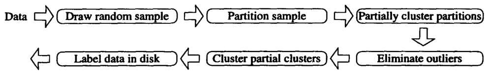
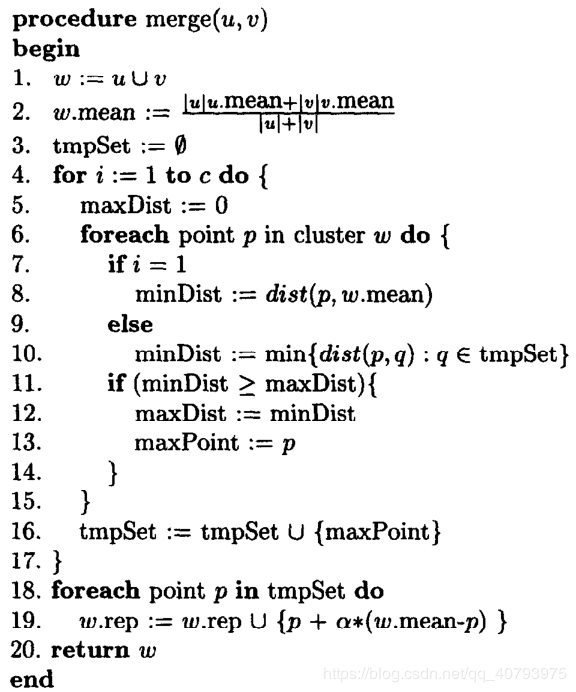
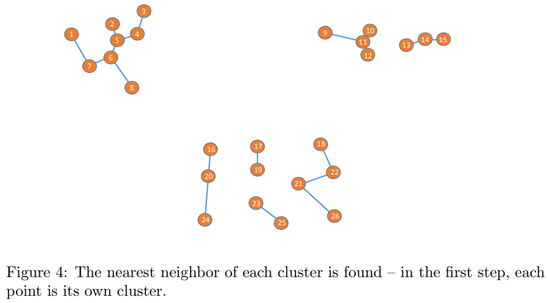
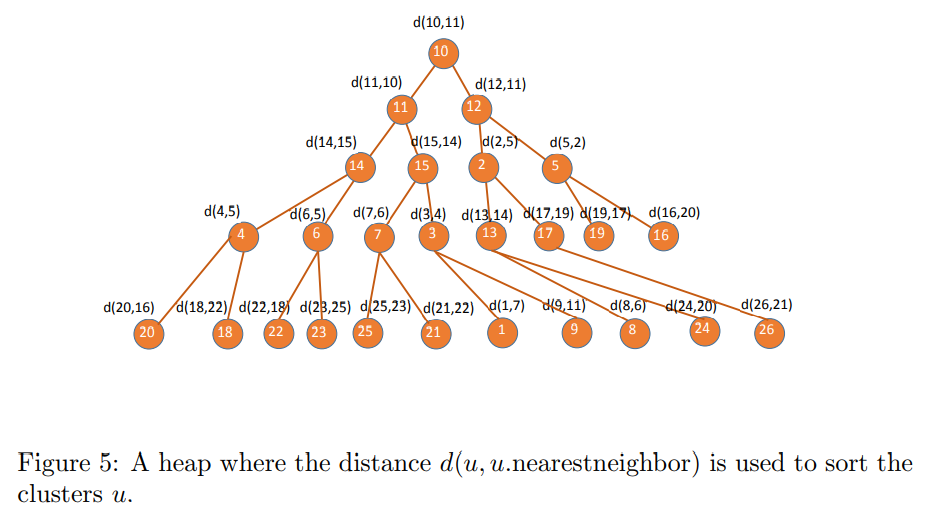
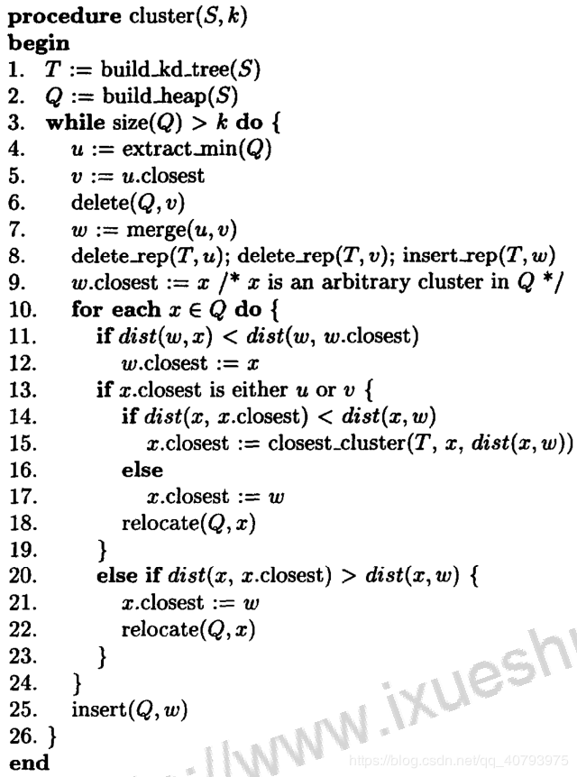

## 引入

**CURE**(Clustering Using REpresentatives)算法是一种比较**高效**的层次聚类算法, 能够处理**大数据集**, 相对于大部分聚类算法(如K-Means)有较强的**鲁棒性**, 并且能够处理**任意形状**和**任意大小**的簇, 也不会受到**离群点**的影响.

CURE算法, 对于一个簇, 使用多个点进行代表. 理论上, 这些点能够捕捉到这个簇的**几何形状**, 因此CURE能够对任意形状的簇进行聚类. 对于每个簇中若干个代表点的选择, 在后续的算法详细说明中阐述. 另外每个簇选取的代表点的数量是一个**超参数**, 一般选择$$c\ge10$$.

## CURE算法流程

CURE算法的基本流程可以表示为下图:

接下来详解每一步的算法逻辑, 以及原理.

### 采样

由于CURE算法是基于层级聚类的, 而层次聚类的效率是非常低的. 如果有$$n$$个样本, 则CURE算法在最坏情况下的时间复杂度可以达到$$O(n^2\log{n})$$. 这样算法就不能使用在大数据集中.

为了改进这个问题, 加快聚类过程, CURE算法首先对所有的样本进行随机采样. 这里的采样过程是**完全随机**的, 从$$n$$个样本中抽取$$s$$个样本进行后续的操作. 通过这种随机采样, 理论上是可以很大程度上**消除离群点**的.

而需要采样出的样本点数量$$s$$, 一般是通过Chernoff bounds方法得到的. CURE算法的作者认为, 为了以较高的概率确保我们从最后分成的每个簇中, 都至少得到一定数量的点, 采样样本应当保证一定的数量. 这个数量由下式给出:

$$
\begin{aligned}
    s=fm+\frac{m}{m_i}\cdot\log{\frac{1}{\delta}}+\frac{m}{m_i}\sqrt{\log{\frac{1^2}{\delta}}+2fm_i\log{\frac{1}{\delta}}}
\end{aligned}
$$

其中$$m$$为总样本点的数量, $$0\le{f}\le{1}$$. 而对于大小为$$m_i$$的簇$$C_i$$, 我们将以$$1-\delta,\ 0\le{\delta}\le{1}$$的概率, 从簇$$C_i$$中得到至少$$f\times m_i$$个样本.

实践中, 常常把$$f$$和$$\delta$$设为比较小的值, 希望以较高的概率在每个簇中抽取少量样本点.

### 划分

如果采样后的样本数量仍然太多, 为了进一步提高算法的运行速度, CURE会将上一步抽样得到的子数据集进行进一步的**分割**(partition).

假设采样完毕后有$$m$$个样本, 我们想要把这些样本聚类成$$k$$个类. 首先设定一个超参数$$p$$作为划分的个数, 数据集被划分成$$p$$部分, 这样划分后的每个组就有$$\frac{m}{p}$$个样本点.

由于聚类首先是在每个划分的内部首先进行**预聚类**(pre-cluster), 所以这里还有一个超参数$$q$$, $$q\gt1$$, 可以将这个$$q$$理解为单个划分中某个簇中样本的期望数量. 因此一个划分中簇的数量应当为$$\frac{m}{pq}$$, 考虑所有划分, 预聚类产生的簇的总数量是$$\frac{m}{q}$$.

在参数选择的时候需要确保$$\frac{m}{pq}$$显著大于$$k$$, 这样在后续的合并过程中, 能较大程度上避免两个不属于同一个类的簇被合并在一起.

### 预聚类

CURE算法的的层次聚类过程分为两步.

首先是每个划分内部单独进行聚类, 这一步称之为**预聚类**. 通过这一步得到$$\frac{m}{q}$$个簇. 把这些簇称为**中间簇**.

然后再对这些中间簇进行聚类, 经过删除**离群点**等步骤, 最终得到预先指定数量的簇.

注意在所有步骤中的簇, 每个都是由**多个代表点**进行代表的, 最后得到的簇也是由代表点代表的. 因此最后需要将数据集中**剩余的点**指派到距离最近的代表点所属的簇中.

首先来看第一步的预聚类是怎么完成的.

对于刚通过采样和分割之后得到的一个划分, 其中的每个样本点都是一个**单簇**(凝聚层次算法), 由于每个簇只包含一个样本点, 所以这个样本点就是这个簇的代表点, 每个簇也都只包含一个代表点(实际上当一个簇中的样本点不大于$$c$$时, 簇中的每个样本点都是代表点). 然后我们需要对这些簇进行凝聚层次聚类, 在CURE算法中, 簇的距离, 合并都**只与代表点有关**, 当然第一步的代表点就是这个簇中唯一一个样本点.

预聚类中对两个簇进行合并, 需要计算得到合并后的簇中的**代表点**. 簇合并算法的伪代码如下:

选择代表点的整个过程可以表述为: 首先选择簇中距离质心最远的点做为第一个代表点, 然后依次选择距离已选到的所有代表点最远的点, 直到选到$$c$$个点为止. 这样选择的代表点捕获了簇的形状和大小. 然后将这些选取到的点根据参数$$\alpha,\ 0\le\alpha\le1$$向这个簇的**质心**收缩, 距离质心越远的点的收缩程度越大, 这种方法可以有效的**降低离群点带来的不利影响**, 这样CURE算法对离群点是不太敏感的.

具体来说, 对于簇$$u$$和$$v$$, 我们将其合并, 组成新的簇$$w$$.

- 首先对于每个簇都有一个**质心**, 例如$$u$$的质心我们使用`u.mean`来表示. 那么第一步就是计算新簇$$w$$的质心, 计算方法为上面伪代码中的第2行
  - 可以看出新的质心`w.mean`是由原来两个簇的质心**加权平均**计算得到的, **权重就是每个簇中样本点的数量**, 这样新簇的质心会更偏考样本较多的簇, 这也是符合常理的
- 接下来就是寻找这个新簇的**代表点**. 寻找第一个代表点的方法与剩余的$$c-1$$个不同, 单独列出. 在得到新簇的质心`w.mean`之后, 我们循环新簇$$w$$中的所有点, 包括代表点和非代表点, 找到离质心最远的点作为第一个代表点
- 找到第一个代表点之后, 在生成其余的代表点时, 仍然对剩余的所有点进行循环, 计算每个点距离当前已有的代表点的最近距离, 然后在这些点中选取一个距离最远的点, 作为新的代表点, 加入到代表点集合中. 如此循环, 直到找到共$$c$$个代表点, 或簇中已经没有其他的点(簇中点小于$$c$$的情况)

在找到所有代表点之后, 需要对所有的代表点**向新簇的质心方向进行收缩**, 收缩的方法见伪代码第19行. 具体来说需要一个收缩因子$$\alpha,\ 0\le\alpha\le1$$, 这是一个超参数, 然后计算每个代表点距离质心的距离, 从公式来看, 距离质心越远的点收缩程度越大, 这就在很大程度上消除了**离群点**的影响.

这里的收缩因子$$\alpha,\ 0\le\alpha\le1$$作为一个超参数, 影响着整体聚类的表现. 如果$$\alpha=0$$, 则预聚类这种层次聚类等价于**基于质心的层次聚类**; 如果$$\alpha=1$$, 则等价于**单链层次聚类**.

另外需要注意的是, 上面的伪代码中寻找代表点的过程是对新簇中所有样本点进行循环, 如果考虑进一步提高聚类的效率, 可以对**两个簇中原来所有的代表点**进行循环判断, 从原来$$2c$$个代表点中选择出$$c$$个新的代表点. 这种方法牺牲了部分精度, 但可以直观的看到极大的减少了计算量.

---

上面是将两个簇合并成一个簇的过程, 那么在CURE中的层次聚类中, 每一步聚类时如何确定哪两个簇进行合并?

层次聚类的每一步簇合并, 肯定选择距离最近的两个簇进行合并. 而在CURE算法中, 簇之间距离的计算方法类似于单链方法. **计算两个簇所有代表点之间的距离, 选取最近的两个代表的之间的距离, 作为簇之间的距离**.

而CURE算法在计算寻找现阶段两个最近簇的时候, 为了提高效率, 引入一个**最小堆**(Heap)结构. 以初始时单簇为例, 这时每个簇只包含一个样本点, 也即代表点, 对于每个代表点计算它与其他所有代表点之间的距离, 找到距离最近的代表点, 这一步也就完成了对于每个簇, 发现了距离其最近的另一个簇, 并且有两个簇之间的距离, 即簇与其最邻近的簇之间的距离.

接下来, 利用这些距离构建一个最小堆. 由于堆中的每一个点是距离, 而这个距离也记录了来源于那两个簇. 因此堆中的每一个点为$$d(u,u.\text{nearestneighbor})$$. 上面的例子可以表示为下图:

因此, 再层次聚类过程中, 每次从最小堆的堆顶取出当前距离最近的两个簇进行合并. 合并按上述方法进行. 合并完成后, 对堆按照一定的方法进行调整, 下文有具体的调整方法.

另外, CURE算法还引入了一颗**k-d树**, 用来快速的计算距离当前坐标最近的代表点. 这颗k-d树的使用方法在后面有详细的描述.

### 对`预聚类`的结果进行聚类

在对每个划分进行预聚类之后, 得到共$$\frac{m}{q}$$簇之后, 再使用与预聚类中同样的层次聚类方法进行聚类. 只不过这里的初始输入不再是单簇(每个簇只有一个样本点), 而是预聚类得到的**中间簇**. 这里的聚类方法与上面相同, 也是使用**堆**和**k-d树**进行的. 最终得到指定的数量$$k$$个类.

### 删除离群点

CURE算法在第一步**随机采样**进行完毕后, 就能够剔除掉大部分异常点, 离群点. 剩余的离群点在分割过程中被进一步隔离, 因此这些离群点往往距离其他样本很远, 因此它所代表的簇, 往往规模**增长十分缓慢**, 导致**簇的大小远远小于其他簇**.

CURE算法会在层次聚类的过程中, 分两个阶段对这些离群点进行剔除. 这个过程也称之为**剪枝**过程.

第一个阶段出现在簇的数量在整体簇的数量缩减为初始簇(采样样本点)的数量一定比例是, 常用是的比例是$$\frac{1}{3}$$.

第二个计算是簇的数量是最终指定的簇的数量$$k$$的一个常数倍时, 这个常数一般比较小.

两个阶段都是将当时一些包含的样本点数量非常少的簇(如只有1到2个样本点)进行剔除. 这个两个剔除过程可能发生在预聚类过程中, 也可能发生在预聚类之后的聚类过程中.

### 为所有点指定类别

最终得到$$k$$个簇之后, 将剩余的所有点, 找到距离其最近的代表点, 这个代表点的类别就是这个点的类别. 这个过程可以使用只包含现有代表点的**k-d**树快速的进行.

## 整体过程与数据结构操作细节

CURE算法整体的伪代码如下图所示:

其中涉及到堆和k-d树的操作. 下面分别对算法中的每一步进行介绍:

- 算法第1-2行: 将CURE算法使用到的两种数据结构k-d树$$T$$和堆$$Q$$进行初始化(这里的$$S$$指的是采样完之后的所有样本)
- 算法第3行: 循环停止条件是判断堆中存储的簇的数量是否已经下降达到指定的簇的数量$$k$$
- 算法第4-8行:
  - 从堆中提取出当前距离最近的两个簇$$u$$和$$v$$
  - 将簇$$v$$从$$Q$$中移除
  - 将$$u$$和$$v$$进行合并, 得到新的簇$$w$$
  - 将$$u$$和$$v$$两个簇中原来所有的代表点从树$$T$$中移除, 并将新簇$$w$$中的代表点增加到树$$T$$中
- 算法第9行: 声明与簇$$w$$最近的簇为$$x$$, $$x$$是当前堆$$Q$$中存在的任意一个簇. 接下来就是寻找真正的距离$$w$$最近的簇
- 算法第10行: 对堆中的每一个簇$$x$$进行迭代
- 算法第11-12行: 找到距离簇$$w$$最近的簇
- 算法第13-23行: 实际上是在计算剩余簇与$$w$$之间聚类, 并判断是否需要更新
  - 判断簇$$x$$最近的簇(在堆中有存储)是否为簇$$u$$或者$$v$$
    - 如果是, 再判断$$x$$与其最近的簇之间的距离是否小于$$x$$与$$w$$之间的距离
      - 如果是, 就在当前所有簇中重新寻找一个最近的簇, 进行更新. 这是因为对于$$x$$簇, 最近的簇消失了, 但与新簇$$w$$之间的距离相对之前变大了, 因此需要重新搜索
      - 如果不是, 则簇$$w$$就是$$x$$最近的簇
      - 因为这一步, 无论内部的判断结果如何, 簇$$x$$的最近簇都发生了变化, 都需要对堆进行调整
    - 如果不是, 继续判断$$x$$与其最近的簇之间的距离是否大于$$x$$与$$w$$之间的距离
      - 如果是, 将$$x$$的最近簇更新为$$w$$, 并将这个距离重新投入到堆中, 并对堆进行调整
    - 如果都不是, 则无需进行任何调整, 继续下一个簇的判断
- 算法第25行: 将新簇$$w$$的信息插入到堆中

## 使用方法

在`pyclustering`包中有CURE算法相关的模型类和方法, 类说明和使用例子参考:

- [pyclustering.cluster.cure.cure Class Reference](https://codedocs.xyz/annoviko/pyclustering/classpyclustering_1_1cluster_1_1cure_1_1cure.html)
- [cure_examples.py](https://github.com/annoviko/pyclustering/blob/master/pyclustering/cluster/examples/cure_examples.py)

## 参考资料

- [Summary: CURE](https://www.cs.ucsb.edu/~veronika/MAE/summary_CURE_01guha.pdf)
- [CURE算法详解](https://blog.csdn.net/qq_40793975/article/details/83574309)
- [数据挖掘导论](http://product.dangdang.com/20995639.html)
