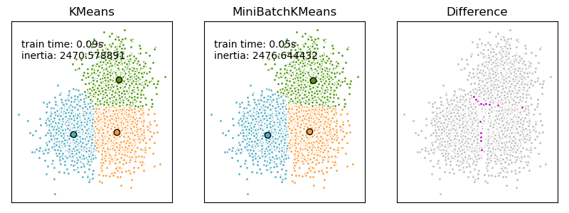

## K-Means原理

**K-Means**算法的原理将每个样本点分配到一个组中, 并且最小化每个组内部的**均方误差SSE**(Sum of the Squared Error). 因此需要先指定簇的数量.

K-Means算法在大量样本的情况下一般都能够表现的很好, 广泛地应用在多种实际场景中.

用公式正式的表示, K-Means算法将一组数量为$$N$$的样本集$$X$$, 分成$$K$$组互不相交的簇集合$$C=\{C_1, C_2, \cdots, C_K\}$$, 每个簇用这个簇中所有样本的**均值向量**$$\mu_j,\ j=1,2,\cdots,K$$来表示, 这个均值向量也被称为这个簇的**中心点**(centroid). 则K-Means算法的目标是最小化:

$$\sum_{i=0}^{n}\min_{\mu_j \in C}(||x_i - \mu_j||^2)$$

均方误差SSE, 可以衡量一个簇内部的一致性, 但使用这个方法有以下几个问题:

- 最小化SSE就是假设测是**凸的**(convex)且是**各向同性的**(isotropic). 实际中很多数据都不是这种形式, 因此算法不能处理细长的以及各种不规则形状的数据集
- 在高维空间中, 使用**L2距离**, SSE就会趋向于数值爆炸(维度诅咒). 如果必须使用K-Means算法, 可以在聚类之前先使用一些**降维算法**, 如**PCA**算法, 这样不仅能消除这个问题, 还能带来计算数度的提升

K-Means算法的计算步骤如下:

- 随机地从样本集中选择$$K$$个点作为初始的中心点
- 对于每个样本, 计算样本与$$K$$个中心点的距离, 这里的距离有多种选择, 最长用L2距离. 将样本指派给距离最短的中心点, 每个中心点代表一个簇
- 对于每个簇, 使用属于该簇的所有点更新该簇的中心点向量

    $$\mathbf{\mu}_i^{'}=\frac{1}{|C_i|}\sum_{\mathbf{x}\in{C_i}}\mathbf{x}$$
- 重复以上两个步骤, 直到新老中心点之间的移动距离小于一个阈值, 或者达到最大迭代轮数

在python中, 使用`sklearn.cluster.KMeans`. 初始化模型时有以下的重要参数:

- n_clusters: int, optional, default: 8
  - 簇的指定数量
- init: {'k-means++', 'random' or an ndarray}
  - 初始化的方法, 默认是使用`k-means++`, 即初始化多次, 取SSE最小的一次拟合作为最佳模型, 这用这个模型作为结果
- n_init: int, default: 10
  - 初始化的次数
- max_iter: int, default: 300
  - 最大迭代次数
- tol: float, default: 1e-4
  - 判定是否收敛的阈值
- verbose: int, default 0
- n_jobs: int

除了需要指定簇的数量, 其余的参数一般使用默认即可. 如果对速度有要求, 可以减小迭代的次数以及初始化的次数进行加速.

## 算法改进

### 初始化

首先, K-means算法是**一定会收敛**的. 但是对于不同的初始中心会收敛到不同的**局部最小**, 即初始化会对最后的结果造成非常大的影响. 因此在实际使用时, 往往需要进行多次初始化, 这在`sklearn`的方法中就有体现.

最常用的解决上面问题的算法改进为**k-means++**. 这种算法会进行多次初始化, 并且保证**不同初始化的中心点集合之间都有一定的距离**. 这也是`sklearn.cluster.KMeans`模型中默认的方法, 通过`init='k-means++'`指定.

### 加速

**Mini Batch K-Means**算法是K-means算法的变种, 原来的K-means算法在每轮迭代中都使用所有样本进行计算, 而改进之后的迭代使用**mini-batches**以减少计算量. Mini-batches从样本集中随机抽样得到, 而最后得到的结果肯定是会变差, 但一般只有轻微的损失.

在Mini Batch K-Means中, 迭代过程修改如下:

- 从样本集中随机抽样出一定的样本子集, 组成mini-batch
- 将这个子集中的每个点分配给中心点, 分配方法不变
- 更新簇的中心点, 这里的更新与之前保持一致, 使用隶属于这个簇的所有样本进行更新, 就不考虑此时的mini-batch了

使用`sklearn.cluster.MiniBatchKMeans`进行实践, 此类初始化时大部分参数与`sklearn.cluster.KMeans`中的相同, 需要注意以下参数:

- batch_size: int, optional, default: 100
  - batch的大小

## 参考资料

- [K-means](https://scikit-learn.org/stable/modules/clustering.html#k-means)
