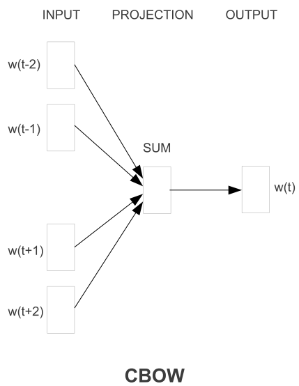
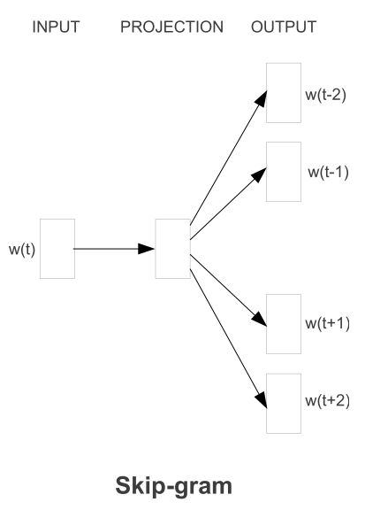

**word2vec**分为**CBOW**和**Skip-gram**两种模型.

## CBOW

CBOW是**Continuous Bag-of-Words Model**的缩写, 这个模型的任务是**根据上下文的词语预测当前词语的出现概率的模型**, 表示如下图:

 

已知上下文, 估计当前词语, 其学习目标是最大化**对数似然函数**:

$$\mathcal{L}=\sum\limits_{w\in{C}}\log p(w|Context(w))$$

$$C$$为语料库, $$w$$为其中的任意一个词. 从公式中看出模型的结构:

- **输入层**: 是选定词的上下文的词对应的词向量.
- **投影层**: 对所有单词的词向量简单求和.
- **输出层**: 输出最可能的单词$$w$$, 即从语料库$$C$$中输出一个概率最高的单词, 是一个**多分类问题**.

因此这里一个指定的单词对应训练中的一个样本, 所有的(上下文的一个词, 指定词)对都是输入的一部分, 通过**投影层**共同作用在最后的预测中.

但是语料库中词的数量$$|C|$$是非常大的, 直接使用**softmax**分类是不可行的. 所以使用到了**Hierarchical Softmax**, 具体来说使用到了**霍夫曼树**来进行分级, 简化输出层.

## Skip-gram

Skip-gram模型与CBOW模型的思路相反, 即已知当前词语, 预测上下文的词语, 结构如下:

与CBOW模型的区别在于:

- 输入层不再是多个词向量, 而是一个词向量
- 投影层没有任何操作, 将输入直接传到输出层中, 而CBOW的的投影层有一个将所有词向量求和的动作

这是一个词袋模型, 一个(当前词, 上下文中的一个词)对就是一个训练样本, 每个当前词对应多个样本(或表达为能产生多个样本), 这点也是与CBOW模型不同的地方.

## CBOW与Skip-gram的区别与联系

对于句子:

`I want a glass of orange juice to go alone with my cereal.`

选定`orange`为**当前词**, 规定上下文的窗口为3, 则两个模型的样本情况如下:

- **CBOW**: 从`a glass of _ juice to go`这6个单词中构造出6个词对, 如(glass, orange)等. 在一次训练中, 将这6个词对都输入到模型中, 将这6个单词的词向量求和然后预测单词`orange`.
- **Skip-gram**: 从`a glass of _ juice to go`中抽样若干个单词(实际中使用的更好的抽样方法后文阐述), 组成(orange, juice)形式的样本, 每次训练输入一个词对, 使用当前词预测上下文中的词.

#### 特点

- **CBOW**
  - 小型语料使用该模型更好
  - 对于句法模型使用这种模型训练出来的词向量更好
- **Skip-gram**
  - 大型语料使用该模型训练更好
  - 特别适用于**语义任务**的模型
