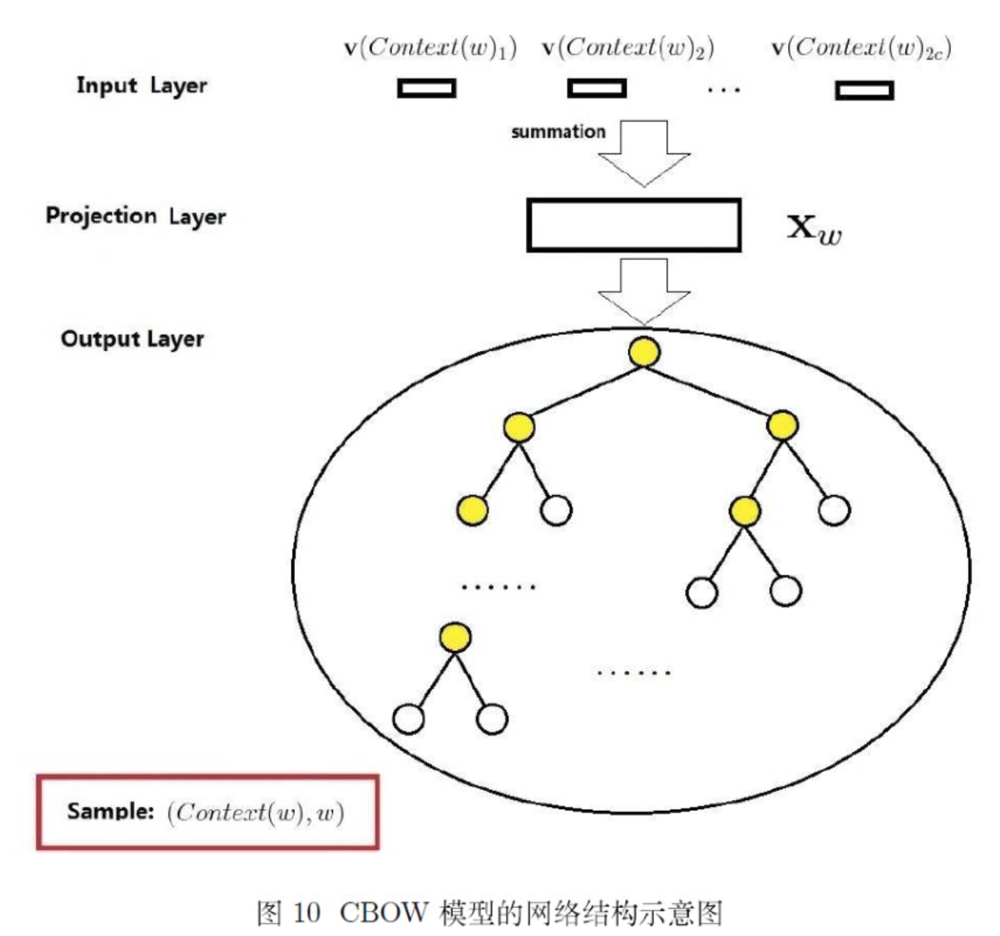

## 原因

无论是**CBOW**模型还是**Skip-gram**模型, 输出层都是预测出一个单词. 由于语料库中词语的数量巨大, 因此直接使用**softmax**输出预测结果是几乎不可行的. 所以需要使用**Hierarchical Softmax**方法对输出层结构进行优化.

## 霍夫曼树

**Hierarchical Softmax**结构使用**霍夫曼树**来进行优化, 有必要了解霍夫曼树的原理.

霍夫曼树的构建过程如下:

- **输入**: $$n$$个结点(这里每个结点代表一个单词), 对应的权值向量为$$(w_1, w_2, \cdots, w_n)$$
- **输出**: 霍夫曼树
- **过程**
  - 将所有的$$n$$个结点每一个看成一棵**树**, 共有$$n$$棵树, 每棵树的结点都只有一个. 组成森林
  - 在森林中选取根节点权值最小的两棵树进行合并, 得到一棵新的树. 原来的两棵树分别作为新书的左右子树, 新树的根节点权重为左右子树的根节点权重之和. 然后将原来的两棵树删除
  - 重复上一步, 直到只有一棵树为止

霍夫曼树的特点: 权重高的叶子结点靠近根节点, 编码值较短; 权重低的远离根节点, 编码值较长. 因此整体的编码效率会提高.

## 霍夫曼树应用于word2vec

将霍夫曼树应用在**投影层**(Projection Layer)到**输出层**之间, 用霍夫曼树的结构代替了*softmax*层的映射. 避免了计算字典中所有单词的softmax概率, 在每个结点只需要判断左右两个行进方向, 沿着树一直走到样本单词对应的叶子结点, 整体结构示例如下:

这种霍夫曼树形状的神经网络结构为:

- 非叶子结点相当于一个**神经元**, 有自身的**参数向量**, 长度与设定的词嵌入向量的长度相同. 二分类决策输出`0`或`1`, `0`表示选择左子树, `1`表示选择右子树.
- 每个叶子结点代表语料库中的一个单词, 因此叶子结点的数量就是语料库词汇表中单词的数量.
- 每个结点(除了根节点, 包括非叶子结点和叶子结点)都可以用`0`和`1`唯一地编码
- **投影层**到**输出层**不是一下完成的, 而是沿着树一步步完成的, 结果的路径对应着一个结点的**编码序列**

## Hierarchical Softmax模型的梯度计算

引入符号

- $$w$$: 中心词
- $$x_w$$: 中心词对应的参数向量
- $$p^w$$: 从根节点出发到达词$$w$$对应的叶子结点的路径
- $$l^w$$: 路径$$p^w$$中包含的结点个数, 也即是层数
- $$p_1^w,p_2^w,\cdots,p_{l^w}^w$$: 路径$$p^w$$中包含的结点
- $$d_2^w,\cdots,d_{l^w}^w$$: $$d^w_j\in\{0,1\},\ j=1,2,\cdots,l^w$$, $$d^w_j$$表示路径$$p^w$$中第$$j$$个结点对应的编码(根节点无编码)
- $$\theta^w_1,\theta^w_2,\cdots,\theta^w_{l^{w-1}}$$: 路径$$p^w$$中对应的非叶子结点的**参数向量**

对于每个非叶子结点, 判断下一步的行进方向. 由于每个非叶子结点都是一个**神经元**, 因此每个神经元都会进行**感知机**+**sigmoid激活函数**的操作, 即:

$$P(+) = \sigma(x_w^T\theta) = \frac{1}{1+e^{-x_w^T\theta}}$$

因此对应一个$$(w,\ \text{Context}(w))$$样本, 对应的条件概率(似然函数)为:

$$p(w|\text{Context}(w))=\prod\limits_{j=2}^{l^w}p(d^w_j|x_w,\theta^w_{j-1})$$

从根节点到叶子结点经历了$$l^{w-1}$$个结点. 而其中的每一项都是一个逻辑回归:

$$p(d^w_j|x_w,\theta^w_{j-1}) = \begin{cases} \sigma(x_w^T\theta^w_{j-1}), \quad & d^w_j=0 \\ 1- \sigma(x_w^T\theta^w_{j-1}), \quad & d^w_j=1 \end{cases}$$

用逻辑回归常用的形式, 写在一起有:

$$p(d^w_j|x_w,\theta^w_{j-1})=[\sigma(x_w^T\theta^w_{j-1})]^{1 - d^w_j}[1-\sigma(x_w^T\theta^w_{j-1})]^{d^w_j}$$

对于一个中心词$$w$$求最大似然:

$$\mathcal{L}=\log \prod_{j=2}^{l_w}P(d_j^w|x_w, \theta_{j-1}^w) = \sum\limits_{j=2}^{l_w} ((1-d_j^w) \log [\sigma(x_w^T\theta_{j-1}^w)]  + d_j^w \log[1-\sigma(x_w^T\theta_{j-1}^w)])$$

求**最大似然**, 对每个样本, 带入偏导数表达式求得函数在该参数上的增长梯度, 使用**梯度上升法**更新参数. 这里有两个参数:

- 每个结点的参数向量$$\theta^w_{j-1}$$, 求得偏导数为:

  $$\begin{aligned} \frac{\partial L}{\partial \theta_{j-1}^w} & = (1-d_j^w)\frac{(\sigma(x_w^T\theta_{j-1}^w)(1-\sigma(x_w^T\theta_{j-1}^w)}{\sigma(x_w^T\theta_{j-1}^w)}x_w - d_j^w \frac{(\sigma(x_w^T\theta_{j-1}^w)(1-\sigma(x_w^T\theta_{j-1}^w)}{1- \sigma(x_w^T\theta_{j-1}^w)}x_w  \\ & =  (1-d_j^w)(1-\sigma(x_w^T\theta_{j-1}^w))x_w -  d_j^w\sigma(x_w^T\theta_{j-1}^w)x_w \\& = (1-d_j^w-\sigma(x_w^T\theta_{j-1}^w))x_w \end{aligned}$$

- 单词$$w$$对应的嵌入参数向量$$x_w$$, 这就是我们最终需要的单词对应的词向量. 求得到偏导数为

  $$\frac{\partial L}{\partial x_w} = \sum\limits_{j=2}^{l_w}(1-d_j^w-\sigma(x_w^T\theta_{j-1}^w))\theta_{j-1}^w$$

---

关于**Hierarchical Softmax**结构还有几点需要注意的地方:

- 作为一个层级形式的神经网络结构, 与平常使用的结构(DNN)不同的地方是, 每一层神经元的输出结果都是一个标量, 用作选择下一步前进的方法, 而不是产生向量继续输入到这个结点的子树中去
- 因此每个结点的输入也就不是上层的结果, 而都是**输入层单词**$$w$$对应的嵌入参数向量$$x_w$$, 整个路径中的所有神经元的输入都是这个向量

## 基于Hierarchical Softmax的CBOW模型

**CBOW**模型结合**Hierarchical Softmax**中需要注意的部分.

定义上下文的**单侧窗口大小**为$$c$$, 对于每个**中心词**, 其前面的$$c$$个词和后面的$$c$$个词都作为CBOW模型的输入.

从**输入层**到**隐藏层**的映射为对中心词$$w$$周围的$$2c$$个词的词向量求和并平均, 也可以只求和不平均, 并没有什么区别, 因此在最后**梯度上升时**的**学习率**与这里求平均可以结合在一起. 因此得到:

$$x_w=\sum\limits_{i=1}^{2c}x_i$$

然后通过梯度上升法来更新$$\theta^w_{j-1}$$和$$x_w$$, 这里的$$x_w$$向量是$$2c$$个单词之和. 更新形式为:

$$\theta_{j-1}^w = \theta_{j-1}^w + \eta  (1-d_j^w-\sigma(x_w^T\theta_{j-1}^w))x_w$$

$$x_w= x_w +\eta  \sum\limits_{j=2}^{l_w}(1-d_j^w-\sigma(x_w^T\theta_{j-1}^w))\theta_{j-1}^w \;(i =1,2..,2c)$$

其中的$$\eta$$就是学习率.

整体总结如下:

- **输入**: 训练语料样本, 上下文单侧窗口长度$$c$$, 学习率$$\eta$$

- **输出**: 所有词$$w$$的词向量$$x_w$$; 非叶子结点参数$$\theta$$

- **过程**

  - 基于语料建立霍夫曼树, 主要是根据词频

  - 随机初始化所有词的词向量, 所有非叶子结点的参数向量

  - 对于训练集中的每一个样本$$(w,\ \text{Context}(w))$$, 使用**梯度上升法**进行求解. 这里的$$\text{Context}(w)$$不是一个单词, 而是中心词$$w$$附近的$$2c$$个上下文单词

    - 中间变量$$e=0$$

    - $$x_w=\sum\limits_{i=1}^{2c}x_i$$

    - $$\text{for } j =2 \text{ to } l^w$$, 计算:

      - $$f = \sigma(x_w^T\theta_{j-1}^w)$$
      - $$g = (1-d_j^w-f)\eta$$
      - $$e = e + g\theta_{j-1}^w$$
      - $$\theta_{j-1}^w= \theta_{j-1}^w + gx_w$$

    - 对于$$\text{Context}(w)$$中包含的每一个词对应的词向量$$x_i,\quad i=1,2,\cdots,2c$$进行相同的更新:

      $$x_i = x_i + e$$

  - 梯度收敛则停止迭代, 否则继续循环上一步

## 基于Hierarchical Softmax的Skip-Gram模型

Skip-gram只是逆转了CBOW的因果关系而已, 对于CBOW, 我们对$$p(w|\text{Context}(w))$$进行最大似然, 对于Skip-Gram就要对$$p(\text{Context}(w)|w)$$进行最大似然了:

$$p(\text{Context}(w)|w)=\prod\limits_{u\in{\text{Context(w)}}}p(u|w)$$

即求中心词$$w$$和上下中每一个词$$u$$的条件概率. 这点与CBOW不同. CBOW是将上下文中所有的词加和起来与中心词产生条件概率, 相当于是两个词之间的关系. 而Skip-gram中是中心词与上下文中每一个词的关系, 因此计算要多一层对上下文词的循环.

另外由于CBOW的条件概率为$$p(w|\text{Context}(w))$$, 是上下文词预测中心词, 所以每一轮梯度上升中更新的是上下文中所有词的词向量. Skip-gram的条件概率为$$p(\text{Context}(w)|w)$$, 是中心词预测上下文词, 那么对于上下午中的所有词, 更新的都是中心词$$w$$对应的词向量$$x_w$$. 这样在迭代的过程可能出现不均衡的现象.

从期望条件概率$$p(u|w)$$的角度来讲, 上下文是相互的, 因此对于$$u$$和$$w$$两个词来说, 相互的条件概率是相同的, 因此就可以转换为对条件概率$$p(w|u)$$期望最大. 这样我们就可以跟CBOW模型一样, 在一个中心词样本中, 对所有上下文词对应的向量进行更新了. 区别只在于多了一个对于上下文词的循环层.

因此整个过程总结如下:

- **输入**: 训练语料样本, 上下文单侧窗口长度$$c$$, 学习率$$\eta$$
- **输出**: 所有词$$w$$的词向量$$x_w$$; 非叶子结点参数$$\theta$$
- **过程**:
  - 基于语料建立霍夫曼树, 主要是根据词频
  - 随机初始化所有词的词向量, 所有非叶子结点的参数向量
  - 对于训练集中的每一个样本$$(w,\ \text{Context}(w))$$, 使用**梯度上升法**进行求解. 这里的$$\text{Context}(w)$$不是一个单词, 而是中心词$$w$$附近的$$2c$$个上下文单词
    - $$\text{for } i =1 \text{ to } 2c$$, 即对上下文中的每个词:
      - 中间变量$$e=0$$
      - $$\text{for } j =2 \text{ to } l^w$$, 计算:
        - $$f = \sigma(x_w^T\theta_{j-1}^w)$$
        - $$g = (1-d_j^w-f)\eta$$
        - $$e = e + g\theta_{j-1}^w$$
        - $$\theta_{j-1}^w= \theta_{j-1}^w + gx_w$$
      - $$x_i = x_i + e$$
  - 梯度收敛则停止迭代, 否则继续循环上一步

## 参考

[word2vec原理推导与代码分析](http://www.hankcs.com/nlp/word2vec.html)

[word2vec原理(二) 基于Hierarchical Softmax的模型](https://www.cnblogs.com/pinard/p/7243513.html)
