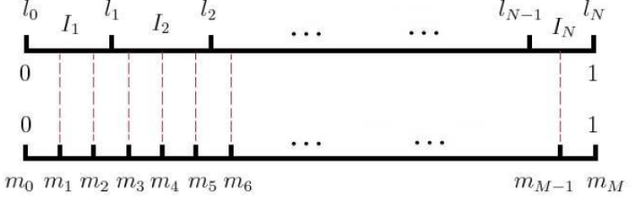

## 使用Negative Sampling的目的

摒弃**Hierarchical Softmax**结构, 原因:

- 我们的训练样本里的中心词$$w$$是一个很生僻的词, 就要在树结构中探索较深

为了简化模型, 使用**Negative Sampling**来代替Hierarchical Softmax模型结构

## Negative Sampling原理

对于中心词$$w$$, 总计$$2c$$个上下文词, 即为$$\text{Context}(w)$$. 由于是语料中存在的上下文关系, 令$$w$$与$$\text{Context}(w)$$为一个**正样本**. 然后在字典中采样, 得到$$\text{neg}$$个和$$w$$不同的词作为中心词, 这在语料中是不存在的(或者说极大概率是不存在的), 因此将采样到的每个中心词$$w_i,\ i=1,2,\cdots,\text{neg}$$和$$\text{Context}(w)$$作为一个**负样本**.

最后的输出层就演变成了若干个并行的二元逻辑回归层, 其数量与字典中词的数量相同. 每个词对应一个二元逻辑回归层, 有着自己独立的参数.

通过对这一个正样本和$$\text{neg}$$个负样本的二元逻辑回归, 更新这$$\text{neg}+1$$个词的逻辑回归参数和每个词的词向量.

## Negative Sampling负采样方法

Negative Sampling需要采样$$\text{neg}$$个负样本. 如果词汇表为$$V$$, 其大小为$$|V|$$, 将长度为1的线段**分成**$$|V|$$份, 每份对应词汇表里的一个词, 每个词对应的线段长度是**不一样的**, 高频词对应的线段长, 低频词对应线段短. 最简单的计算每个词对应的线段的长度的方法为:

$$len(w) = \frac{count(w)}{\sum\limits_{u \in vocab} count(u)}$$

在word2vec论文中使用的函数为:

$$len(w) = \frac{count(w)^{3/4}}{\sum\limits_{u \in vocab} count(u)^{3/4}}$$

论文中采用的采样方法具体为: 将长度为1的线段**等分**成$$M$$份, $$M$$远大于$$|V|$$, 这样每个词对应的线段都被划分成若干个更小的线段, 而$$M$$份中的每一份都会落在某个词对应的线段上. 采样时, 只需要采样出这$$M$$个位置中的$$\text{neg}$$个位置, 对应的线段所属的词就是我们要采样出的负样本单词. 论文中$$M=10^8$$.

示例图如下:

## Negative Sampling的梯度计算

将正例的中心词定义为$$w_0$$, 因此就有样本$$(\text{Context}(w_0), w_i),\ i=0,1,2,\cdots,\text{neg}$$. 最大似然法, 最大化下式:

$$\prod_{i=0}^{neg}P(context(w_0), w_i) = \sigma(x_{w_0}^T\theta^{w_0})\prod_{i=1}^{neg}(1-  \sigma(x_{w_0}^T\theta^{w_i}))$$

对应的对数似然函数为:

$$L = \sum\limits_{i=0}^{neg}y_i log(\sigma(x_{w_0}^T\theta^{w_i})) + (1-y_i) log(1-  \sigma(x_{w_0}^T\theta^{w_i}))$$

采用梯度上升法, 每次使用一个样本进行参数更新. 这里我们需要更新的参数为正样本对应的词向量$$x_{w_0}$$, 以及输出层中对应的二元逻辑回归神经元$$\theta^{w_i},  i=0,1,..neg$$.

首先是$$\theta^{w_i}$$的梯度:

$$\begin{align} \frac{\partial L}{\partial \theta^{w_i} } &= y_i(1-  \sigma(x_{w_0}^T\theta^{w_i}))x_{w_0}-(1-y_i)\sigma(x_{w_0}^T\theta^{w_i})x_{w_0} \\ & = (y_i -\sigma(x_{w_0}^T\theta^{w_i})) x_{w_0} \end{align}$$

同样求出$$x_{w_0}$$的梯度:

$$\frac{\partial L}{\partial x^{w_0} } = \sum\limits_{i=0}^{neg}(y_i -\sigma(x_{w_0}^T\theta^{w_i}))\theta^{w_i}$$

## 基于Negative Sampling的CBOW模型

- **输入**: 训练语料样本, 单侧窗口长度$$c$$, 负采样的个数$$\text{neg}$$

- **输出**: 每个词的词向量$$x_w$$, 每个词对应的逻辑回归参数$$\theta$$

- **过程**

  - 随机初始化所有的模型参数$$\theta$$, 所有词向量$$x$$

  - 对于每个训练正样本$$(context(w_0), w_0)$$, 负采样出$$\text{neg}$$个负样本中心词$$w_i, i=1,2,...neg$$

  - 对于训练集中的每一个样本$$(context(w_0), w_0,w_1,...w_{neg})$$, 进行梯度上升:

    - 中间变量$$e=0$$

    - $$x_{w_0}=\sum\limits_{i=1}^{2c}x_i$$

    - $$\text{for } i =0 \text{ to } \text{neg}$$, 计算:

      - $$f = \sigma(x_{w_0}^T\theta^{w_i})$$
      - $$g = (y_i-f)\eta$$
      - $$e = e + g\theta^{w_i}$$
      - $$\theta^{w_i}= \theta^{w_i} + gx_{w_0}$$

    - 对于$$\text{Context}(w_0)$$中包含的每一个词对应的词向量$$x_k,\ k=1,2,\cdots,2c$$进行相同的更新:

      $$x_k = x_k + e$$

  - 梯度收敛则停止迭代, 否则继续循环上一步

## 基于Negative Sampling的Skip-Gram模型

- **输入**: 训练语料样本, 单侧窗口长度$$c$$, 负采样的个数$$\text{neg}$$

- **输出**: 每个词的词向量$$x_w$$, 每个词对应的逻辑回归参数$$\theta$$

- **过程**

  - 随机初始化所有的模型参数$$\theta$$, 所有词向量$$x$$

  - 对于每个训练正样本$$(context(w_0), w_0)$$, 负采样出$$\text{neg}$$个负样本中心词$$w_i, i=1,2,...neg$$

  - 对于训练集中的每一个样本$$(context(w_0), w_0,w_1,...w_{neg})$$, 进行梯度上升:

    - $$\text{for } i =1 \text{ to } 2c$$, 即对上下文中的每个词:

      - 中间变量$$e=0$$

      - $$\text{for } j =0 \text{ to } \text{neg}$$, 计算:

        - $$f = \sigma(x_{w_{0i}}^T\theta^{w_j})$$
        - $$g = (y_j-f)\eta$$
        - $$e = e + g\theta^{w_j}$$
        - $$\theta^{w_j}= \theta^{w_j} + gx_{w_{0i}}$$

      - 对于$$\text{Context}(w_0)$$中包含的每一个词对应的词向量$$x_k,\ k=1,2,\cdots,2c$$进行相同的更新:

        $$x_k = x_k + e$$

  - 梯度收敛则停止迭代, 否则继续循环上一步

