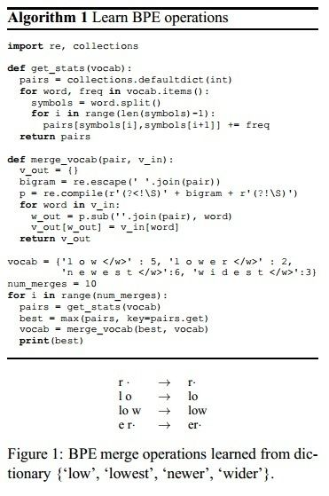

## 引入

作者从机器翻译(Neural machine translation, NMT)场景出发, 分析了机器翻译中一个常见并且关键的问题: **out-of-vocabulary, OOV**.

因为一般用来训练一个模型的词汇量一般在30000-50000之间, 但机器翻译又是一个词汇表开放的问题, 词汇往往具有可创造性, 例如通过组合或者合成的方法得到新的单词.

作者从命名实体, 同根词, 外来语, 组合词(这些都是翻译过程中遇到的低频词, 或者成为罕见词)的人工翻译策略中得到启发, 认为把这些单词拆分为更小的**子词单元(subword units)**, 可有效地缓解OOV的问题(相对于使用包含这些低频词更大的词汇表).

例如:

- 命名实体: 
  - `Barack Obama`
  - 实体中每个单词分开进行翻译
- 外来词:
  - `claustrophobia (English) => Klaustrophobie (German)`
  - 按照字符拆解后翻译(适用于西方语言之间的翻译)
- 语义复杂词汇
  - `solar system (English) => Sonnensystem (Sonne + System) (German)`
  - 按语义拆分单词, 每个单词按意思进行翻译

在论文中, 作者使用了**Byte Pair Encoding, BPE**算法将单词拆分为subwords. 这是一种数据压缩算法, 循环地将频率最高的一对词合并起来. 这个算法的过程如下图所示:

过程如下:

- 首先将所有词从按单个字符逐个分开, 每个单词的最后一个字符添加一个特殊的字符$$\cdot$$表示截尾, 从而得到character vocabulary
- 对所有紧邻的对统计出现的频率, 选取频率最高的一对进行合并得到新的subword, 对所有文本中的这一对进行合并
- 使用新得到的subword表征后, 重新统计频率, 然后再次选择频率最高的一对进行合并, 如此重复
- 知道这种合并操作重复一定的次数, 或者词汇表中共有指定数量的subwords后停止. 这是一个可调节的超参数

需要注意的是, 统计紧邻的subword对出现的次数时, 不会跨越原有单词的边界, 这一点由添加的这个特殊字符保证.

本文还探讨了BPE的两种编码方式: 一种是源语言词汇和目标语言词汇分别编码, 另一种是双语词汇联合编码. 前者的优势是让词表和文本的表示更紧凑, 后者则可以尽可能保证原文和译文的子词切分方式统一. 从实验结果来看, 在音译或简单复制较多的情形下(比如英德)翻译, 联合编码的效果更佳.

## 参考资料

- [PaperWeekly 第七期 -- 基于Char-level的NMT OOV解决方案](https://zhuanlan.zhihu.com/p/22700538)
- [一分钟搞懂的算法之BPE算法](https://cloud.tencent.com/developer/article/1089017)
- 代码: [Subword Neural Machine Translation](https://github.com/rsennrich/subword-nmt)
