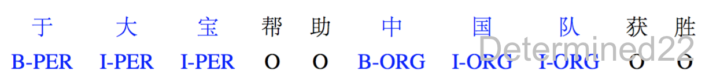

## 命名实体识别

### 定义

**命名实体识别(Named Entity Recognition, NER)**, 是指从文本中识别出**命名性指称项**, 也就是**人名**, **地名**, **组织机构名称**以及各个领域中**特定的实体类型**.

一般使用**条件随机场(CRF)**就能完成这种任务. 为了进一步提高识别率, 结合神经网络, 提出了**BiLSTM-CRF**模型. 主要目的是用神经网络进行表征, 自动提取出有效特征, 代替CRF中常用的**人工规则**计算得到的特征.

### 方法

**基于特征模板的方法**

统计机器学习方法将NER视作**序列标注任务**, 利用大规模语料来学习出标注模型, 从而对句子的各个位置进行标注.

常用的应用到NER任务中的模型包括:

- **生成式模型HMM**
- **判别式模型CRF**

比较流行的方法是**特征模板+CRF**的方案.

**特征模板**通常是人工定义的一些**二值**特征函数, 试图挖掘命名实体内部以及上下文的构成特点. 对于句子中的给定位置来说, 提特征的位置是一个窗口, 即上下文位置, 而且不同的特征模板之间可以进行组合来形成一个新的特征模板.

**CRF**的优点在于其为一个位置进行标注的过程中可以利用到此前已经标注的信息, 利用**Viterbi解码**来得到最优序列.

对句子中的各个位置提取特征时, 满足条件的特征取值为1, 不满足条件的特征取值为0, 然后把特征传给CRF, **训练阶段**建模标签的转移, 得到模型的参数, 进而在**推测阶段**为句子的各个位置做标注.

这种方法的一个缺点是对每个token打标签的过程中是独立的分类, 不能直接利用上文已经预测的标签, 只能靠隐状态传递上文信息, 进而导致预测出的标签序列可能是非法的.

**基于神经网络的方法**

将token映射为稠密的embedding, 随后将句子的embedding序列输入到RNN中, 用神经网络**自动提取特征**. Softmax来预测每个token的标签, 这种方法使得模型的训练成为一个**端到端**的整体过程, 而非传统如CRF一样的管道(pipeline), 也不依赖特征工程.

**神经网络+CRF的方法**

在LSTM层后接入CRF层来做**句子级别**的标签预测, 使得标注过程不再是对各个token独立分类.

另外有人提出在英文NER任务中先使用LSTM来为每个单词由**字母**构造词并拼接到词向量后再输入到LSTM中, 以捕捉单词的前后缀等字母形态特征. 还将这个套路用在了中文NER任务中, 用偏旁部首来构造汉字.

## 标注方法

### BIO

- **B**: 命名实体的首字
  - **B-PER**: 人名首字
  - **B-LOC**: 地名首字
  - **B-ORG**: 组织机构首字
- **I**: 命名实体非首字
  - 也有向上面一样的子类
- **O**: 该字不属于命名实体的一部分

## 参考资料

解析文章参考:

- [神经网络结构在命名实体识别（NER）中的应用](http://www.cnblogs.com/robert-dlut/p/6847401.html)
- [序列标注：BiLSTM-CRF模型做基于字的中文命名实体识别](http://www.cnblogs.com/Determined22/p/7238342.html)
- [Sequence Tagging with Tensorflow](https://guillaumegenthial.github.io/sequence-tagging-with-tensorflow.html)
