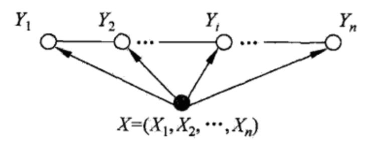
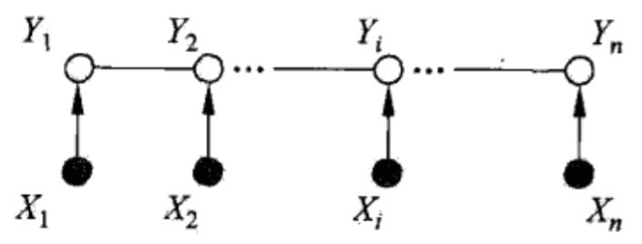

**条件随机场**是给定随机变量$$X$$的条件下, 随机变量$$Y$$的马尔科夫随机场. 在条件概率模型$$P(Y|X)$$中, $$Y$$是**输出变量**, 表示**标记序列**, 也称为**状态序列**; $$X$$是**输入变量**, 表示**观测序列**.

学习时, 使用训练数据集通过(正则化的)**极大似然估计**得到条件概率模型$$\hat{P}(Y|X)$$.

预测时, 对于给定的输入序列$$x$$, 求出条件概率$$\hat{P}(y|x)$$最大的输出序列$$\hat{y}$$.

### 条件随机场

$$X$$与$$Y$$是随机变量, $$P(Y|X)$$是在给定$$X$$条件下, $$Y$$的条件概率分布. 若随机变量$$Y$$构成一个由无向图表示的马尔科夫随机场, 即:

$$P(Y_v|X,Y_w,w\ne{v})=P(Y_v|X,Y_w,w\sim{v})$$

其中, $$w\sim{v}$$表示无向图中与结点$$v$$有边连接的所有结点$$w$$, $$w\ne{v}$$表示无向图除结点$$v$$以外的所有其他结点.

如果上式对任意结点$$v$$成立, 则称条件概率分布$$P(Y|X)$$为**条件随机场**

### 线性链条件随机场

上面两图是线性链条件随机场, 第二张图是第一张的另一种表示.

图的结构即:

假设$$X=(X_1, X_2, \cdots, X_n)$$, $$Y=(Y_1,Y_2,\cdots,Y_n)$$, 在给定随机变量序列$$X$$的条件下, 随机变量序列$$Y$$的条件概率分布$$P(Y|X)$$构成条件随机场, 即满足马尔科夫性:

$$P(Y_i|X,Y_1,Y_2,\cdots,Y_{i-1},Y_{i+1},\cdots,Y_n)=P(Y_i|X,Y_{i-1},Y_{i+1})$$

则称条件概率$$P(Y|X)$$为线性链条件随机场.

上式是由**局部马尔科夫性**得到的, 因为对于满足局部马尔科夫:

$$P(Y_u|Y_W)=P(Y_u|Y_O,Y_W)$$

$$Y_i$$对应$$Y_u$$, $$Y_{i-1}$$与$$Y_{i+1}$$为与$$Y_i$$相连的点, 对应于$$Y_W$$, 其他的点对应于$$Y_O$$因此可以得到上式. 具体的无向图的马尔科夫性见无向图的介绍.

---

在第一张图中, 观察序列$$X$$的元素之间没有图结构, 即整个观察序列$$X=(X_1, X_2, \cdots, X_n)$$作为无向图中的一个点, 同时与所有状态点$$Y=(Y_1,Y_2,\cdots,Y_n)$$相连, 即有关系.

因此线性链条件随机场的图中, 共有$$n-1$$个最大包, 如$$Y_1Y_2X$$行程了一个最大包. 形如$$Y_{i-1}Y_{i}X,\ i=2,3,\cdots,n$$的子图, 就形成了最大包结构, 可以把条件概率分解成这些最大包函数的乘积形式.

### 条件随机场的参数化形式

首先定义两种**特征函数**:

- 转移特征
    
    转移特征是定义在**边**上的特征函数, 依赖于当前位置和前一个位置, 用$$t_k$$表示, 具体为$$t_k(y_{i-1},y_i,x,i)$$.

    一般定义为:
    
    $$t_k(y_{i-1},y_i,x,i)=
    \begin{cases}
    1,\ y_{i-1},y_{i},x,i\text{ meet certain conditions} \\
    0,\ \text{else}
    \end{cases}$$

- 状态特征
    
    状态特征是定义在**结点**上的特征函数, 依赖于当前位置, 用$$s_l$$表示, 具体为$$s_l(y_i,x,i)$$

    $$s_l(y_i,x,i)=
    \begin{cases}
    1,\ y_{i},x,i\text{ meet certain conditions} \\
    0,\ \text{else}
    \end{cases}$$

对于线性链条件随机场来说, 对条件概率$$P(Y|X)$$进行因子分解, 分解成每个最大包随机变量对应的**势函数**$$\Phi_C(Y_C)$$的乘积, 势函数通常为指数函数. 对于一个最大包, 在线性链条件随机场中, 就是相邻两个$$Y$$结点以及$$X$$结点, 其势函数的定义包含两部分: 1. 相邻状态结点的转移特征; 2. 状态结点的状态特征. 因此将所有的最大包的势函数相乘, 就得到:

$$P(y|x)=\frac{1}{Z(x)}\exp\left(\sum\limits_{i,k}\lambda_kt_k(y_{i-1},y_i,x,i)+\sum\limits_{i,l}\mu_ls_l(y_i,x,i)\right)$$

其中, $$t_k$$和$$s_l$$是特征函数, $$\lambda_k$$和$$\mu_l$$是对应的权值. $$Z(x)$$是规范化因子.

$$Z(x)=\sum\limits_{y}\exp\left(\sum\limits_{i,k}\lambda_kt_k(y_{i-1},y_i,x,i)+\sum\limits_{i,l}\mu_ls_l(y_i,x,i)\right)$$

这就是在观测序列取值为$$x$$, 状态序列取值为$$y$$的条件下, 条件概率$$P(y|x)$$的因子拆解形式.

可以看出, 与**逻辑回归**和**最大熵模型**一样, **线性链条件随机场**也是**对数线性模型**.

### 条件随机场的简化形式

因为每个特征函数在各个位置$$i$$都有定义, 因此可以对同一个特征函数在各个位置求和, 将局部特征函数转化为一个全局特征函数.

这样就可以将条件随机场写成权值向量和特征向量的内积形式, 即条件随机场的简化形式.

1. 使用统一个符合表示转移特征和状态特征. 假设有$$K_1$$个转移特征, $$K_2$$特征, 那么总特征数量为$$K=K_1+K_2$$, 记为:

    $$f_k(y_{i-1},y_{i},x,i)=\begin{cases}
    t_k(y_{i-1},y_i,x,i),\ k=1,2,\cdots,K_1 \\
    s_l(y_i,x,i),\ k=K_1+l,\ l=1,2,\cdots,K_2
    \end{cases}$$
    
2. 对转移特征和状态特征在所有个位置$$i$$进行求和得到:
    
    $$f_k(y,x)=\sum\limits_{i=1}^{n}f_k(y_{i-1},y_{i},x,i),\ k=1,2,\cdots,K$$

3. $$f_k(y,x)$$的权值用$$w_k$$表示:
    
    $$w_k=\begin{cases}
    \lambda_k,\ k=1,2,\cdots,K_1 \\
    \mu_l,\ k=K_1+l,\ l=1,2,\cdots,K_2
    \end{cases}$$

4. 条件随机场因此可表示为:
    
    $$P(y|x)=\frac{1}{Z(x)}\exp\sum\limits_{k=1}^Kw_kf_k(y,x)$$

    $$Z(x)=\sum\limits_{y}\exp\sum\limits_{k=1}^Kw_kf_k(y,x)$$

5. 向量表示
    
    $$\textbf{w}=(w_1,w_2,\cdots,w_K)^T$$
    
    $$\textbf{F}(y,x)=(f_1(y,x),f_2(y,x),\cdots,f_K(y,x))^T$$
    
    则条件随机场可以写为:
    
    $$P_w(y|x)=\frac{1}{Z_w(x)}\exp\left(\textbf{w}\cdot{\textbf{F}(y,x)}\right)$$

    $$Z_w(x)=\sum\limits_{y}\exp\left(\textbf{w}\cdot{\textbf{F}(y,x)}\right)$$

### 条件随机场的矩阵形式

条件随机场$$P_w(y|x)$$可以通过矩阵的形式来表示. 引入状态序列的起点和终点的状态, $$y_0=start$$, 以及$$y_{n+1}=stop$$, 这里的$$start,\ stop$$都是可能的状态中其中的一个.

给定观测序列$$x$$, 在每一个位置$$i=1,2,\cdots,n+1$$定义一个$$m$$阶的矩阵, 其中$$m$$是$$y_i$$可能的状态的个数.

对于矩阵的其中一个元素, 我们如下定义:

$$W_i(y_{i-1},y_i|x)=\sum\limits_{k=1}^Kw_kf_k(y_{i-1},y_{i},x,i)$$

$$M_i(y_{i-1},y_i|x)=\exp{W_i(y_{i-1},y_i|x)}$$

则$$M_i(y_{i-1},y_i|x)$$是位置$$i$$对应的矩阵中, 由指定状态$$y_{i-1}$$到状态$$y_i$$对应的势函数的值.

将所有可能的状态及状态转移组合起来, 就得到了一个$$m$$阶的矩阵:

$$M_i(x)=[M_i(y_{i-1},y_i|x)]_{m\times{m}}$$

因此, 对于给定的观测序列$$x$$, 某一指定的标记序列$$y$$的非规范化概率可以通过$$n+1$$个矩阵的乘积来表示, 即有:

$$P_w(y|x)=\frac{1}{Z_w(x)}\prod\limits_{i=1}^{n+1}M_i(y_{i-1},y_i|x)$$

其中规范化因子$$Z_w(x)$$为$$n+1$$个矩阵的乘积最后得到的矩阵的在$$(start,stop)$$位置上的元素即:

$$Z_w(x)=(M_1(x)M_2(x)\cdots M_{n+1}(x))_{start,stop}$$
