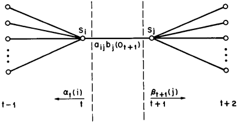

## 训练方法

训练HMM, 用到的是**前向-后向算法(Forward-backward algorithm)**, 又被称之为**Baum-Welch算法**, 这是一种**非监督学习**算法.

## 中间变量

首先是**前向算法**和**后向算法**中的概率.

### 前向概率

对于HMM模型中的参数集合$$\theta$$, **前向概率**定义为: $$n$$时刻部分观测序列为$$x_1, x_2, \cdots, x_n$$, 且当前时刻的隐藏状态为$$z_n$$的概率:

$$\alpha(z_n)=P(x_1,x_2,\cdots,x_n,z_n|\theta)$$

假设隐藏状态的可能数为$$K$$, 则在$$n$$时刻, 对于$$k$$种可能的隐藏状态, 都有一个$$\alpha(z_n)$$与之对应.

**递推公式**

另外前向概率还有如下的递推公式:

$$\alpha(z_n)=P(x_n|z_n)\sum\limits_{z_{n-1}}\alpha(z_{n-1})P(z_n|z_{n-1})$$

即$$n$$时刻的每个可能的隐藏状态的概率都是由上一个时刻所有可能的隐藏状态根据转移概率为权值, 加权得到的.

递推公式中:

- $$P(z_n|z_{n-1})$$为隐藏状态的状态转移概率, 为前面所说的大小为$$K \times K$$的状态转移矩阵$$A$$中$$a_{z_{n},z_{n-1}}$$这个值.
- $$P(x_n|z_n)$$就是隐藏状态为$$z_n$$时对应的观测为$$x_n$$的概率. 对应的就是前面的**观测概率矩阵**(离散)或者是**状态发射函数**(连续)
  - 当观测值$$x$$是有限个状态, 即离散的情况下, 一般就使用前面所说的观测概率矩阵. 如果观测有$$M$$个状态, 则对应于一个$$M \times K$$的概率矩阵
  - 当观测值$$x$$是有无限个状态, 即值域是连续的情况下, 这时的发射函数为**高斯函数**. 具体的说, 对于每个隐藏状态$$k$$(隐藏状态一定是离散的, 即数量有限的), 都对应于一套独自的高斯分布参数$$\mu_k$$和$$\Sigma_k$$, 因此每个隐藏状态生成观测值$x$时也就有所区别.

**初始状态**

- $$\alpha(z_1)=P(x_1|z_1)\pi_{z_1}$$

对于具体的某个隐藏状态$$k$$, 初始状态值为:

- $$\alpha(z_{1k})=P(x_1|z_{1k})\pi_{z_{1k}}$$

### 后向概率

对于HMM模型中的参数集合$$\theta$$, **后向概率**定义为: $$n$$时刻, 当前的隐藏状态为$$z_n$$的条件下, 从$$n+1$$时刻到最后一个时刻$$N$$的部分观测序列为$$x_{n+1}, \cdots, x_{N}$$的概率:

$$\beta(z_n)=P(x_{n+1}, \cdots, x_{N}|z_n,\theta)$$

**递推公式**

与前向概率不同, 后向概率从序列最后向前递推. 递推公式为:

$$\beta(z_n)=\sum\limits_{z_{n+1}}\beta(z_{n+1})P(x_{n+1}|z_{n+1})P(z_{n+1}|z_n)$$

**初始状态**

对于序列的最后时刻, $$N$$时刻, 有:

$$\beta(z_N)=1$$

这一概率对于所有$$z_N$$都成立. 至于为何值为1, 在后面有讲解.

### 观测概率

对于马尔科夫模型$$\theta$$, 出现当前的观测序列$$X$$的概率为:

$$P(X|\theta)=P(X)$$

使用**前向概率**, 我们可以认为:

$$P(X)=\sum\limits_{z_N}P(X,z_N)=\sum\limits_{z_N}\alpha(z_N)$$

使用**后向概率**, 我们可以认为:

$$P(X)=\sum\limits_{z_1}P(X|z_1)P(z_1)=\sum\limits_{z_1}P(x_1|z_1)P(x_2,\cdots,x_N)P(z_1)=\sum\limits_{z_1}P(x_1|z_1)\beta(z_1)\pi(z_1)$$

因此整个观测序列的发生概率既可以用前向概率表示, 也可以用后向概率表示:

$$P(X)=\sum\limits_{z_N}\alpha(z_N)=\sum\limits_{z_1}P(x_1|z_1)\beta(z_1)\pi(z_1)$$

因为在后面的计算中, 需要用到$$P(X)$$作为**归一化**的因子使用, 因此需要求出当前模型参数下的观测概率. 为了方便, 一般使用$$P(X)=\sum\limits_{z_N}\alpha(z_N)$$计算得到.

### 中间概率$$\gamma$$

定义对于马尔科夫模型$$\theta$$, 在现有观测序列的条件下, $$n$$时刻, 隐藏状态为$$k$$的概率为$$\gamma(z_{n,k})$$:

$$\gamma(z_{n,k})=P(z_{n}=k|X,\theta)$$

将这个$$\gamma$$概率与上面的**前向概率**和**后向概率**联合起来, 得到他们之间的关系:

$$
\begin{aligned}
\gamma(z_n)  &=P(z_n|X)=\frac{P(X,z_n)}{P(X)}=\frac{P(X|z_n)P(z_n)}{P(X)} \\
&= \frac{\alpha(z_n)\beta(z_n)}{P(X)} \\
&= \frac{\alpha(z_n)\beta(z_n)}{\sum\limits_{z_n}\alpha(z_n)\beta(z_n)} \\
&= \frac{\alpha(z_n)\beta(z_n)}{\sum\limits_{z_N}\alpha(z_N)}
\end{aligned}
$$

由于归一化因子$$P(X)$$就是分母在所有隐藏状态下的概率之和, 因此有$$\sum\limits_{z_n}\gamma(z_n)=1$$.

### 中间概率$$\xi$$

定义对于马尔科夫模型$$\theta$$和观测序列$$X$$, 在$$n-1$$时刻处于$$z_{n-1}$$状态, 在$$n$$时刻处于$$z_{n}$$状态的概率为$$\xi(z_{n-1},z_{n})$$:

$$\xi(z_{n-1},z_{n})=P(z_{n-1},z_n|X,\theta)$$

将$$\xi$$与上面的**前向概率**和**后向概率**联合起来, 得到他们之间的关系:

$$
\begin{aligned}
\xi(z_{n-1},z_{n}) &= P(z_{n-1},z_n|X) \\
&= \frac{P(X,z_{n-1},z_n)}{P(X)} \\
&= \frac{P(X|z_{n-1},z_n)P(z_{n-1},z_n)}{P(X)} \\
&= \frac{P(x_1,\cdots,x_{n-1}|z_{n-1})P(x_n|z_n)P(x_{n+1},\cdots,x_N|z_n)P(z_n|z_{n-1})}{P(X)} \\
&= \frac{\alpha(z_{n-1})P(x_n|z_n)\beta(z_n)P(z_n|z_{n-1 })}{P(X)} \\
&= \frac{\alpha(z_{n-1})P(x_n|z_n)\beta(z_n)P(z_n|z_{n-1 })}{\sum\limits_{z_n}\alpha(z_{n-1})P(x_n|z_n)\beta(z_n)P(z_n|z_{n-1 })} \\
&= \frac{\alpha(z_{n-1})P(x_n|z_n)\beta(z_n)P(z_n|z_{n-1 })}{\sum\limits_{z_N}\alpha(z_N)}
\end{aligned}
$$

中间概率$$\xi(z_{n-1},z_n)$$的推导理解可以由下图说明:

## 训练过程

由于隐藏状态的存在, 直接对观测值求极大似然是无解的, 因此HMM模型的参数$$\theta$$的训练学习可以由**EM算法**实现.

### 目标推导

最优的参数$$\theta$$应当满足对应的**观测序列概率**最大, 即有:

$$\theta=\arg\max\limits_{\theta}P(X|\theta)$$

而HMM作为一种**生成式模型**, 我们的出发点是**观测序列**$$X$$和**隐藏序列**$$Z$$的**联合分布概率**$$P(X,Z|\theta)$$, 观测概率$$P(X|\theta)$$是联合分布概率在各种隐藏状态序列下的**期望值**. 因此有:

$$
\begin{aligned}
\theta &= \arg\max\limits_{\theta}P(X|\theta)=\arg\max\limits_{\theta}E[P(X,Z|\theta)]=\arg\max\limits_{\theta}E[\log P(X,Z|\theta)] \\
&= \arg\max\limits_{\theta}\sum\limits_{Z}P(Z|X,\theta^{'})\log P(X,Z|\theta)
\end{aligned}
$$

上式中的最后一步是对联合分布概率求期望的方法. 由于观测序列$$X$$是已知的, 当前的模型参数$$\theta^{'}$$也是已知的, 此时的随机变量就是在这两个条件下的隐藏状态$$Z$$, 对应的概率就是$$Z$$的条件分布概率.

将上式中的表达式部分记为:

$$Q(\theta,\theta^{'})=\sum\limits_{Z}P(Z|X,\theta^{'})\log P(X,Z|\theta)$$

因为模型参数$$\theta$$是我们的求解目标, 而当前模型参数$$\theta^{'}$$会决定隐藏状态分布的概率, 因此上式是$$\theta$$和$$\theta^{'}$$的函数.

进一步拆解上式, 对于联合分布概率$$P(X,Z|\theta)$$, 可以表示为:

$$
\begin{aligned}
P(X,Z|\theta) &= P(Z|\theta)P(X|Z,\theta) \\
&= P(z_1|\theta)\prod\limits_{n=2}^{N}P(z_n|z_{n-1},\theta)\prod\limits_{n=1}^{N}P(x_n|z_n,\theta)
\end{aligned}
$$

可以将上面的三种概率分别对应于HMM模型中的**隐藏状态的先验分布概率**$$\pi$$, **隐藏状态之间的转移概率**$$\Lambda$$, **已知隐藏状态确定观测值的发射概率**$$\Phi$$. 在加上$$Q$$函数中的$$\log$$符号, 有:

$$\log{P(X,Z|\theta)}=\log{P(z_1|\pi)}+\sum\limits_{n=2}^{N}\log{P(z_n|z_{n-1},\Lambda)}+\sum\limits_{n=1}^{N}\log{P(x_n|z_n,\Phi)}$$

对于第三项**发射概率**, 根据**观测随机变量**的类型, 有两种情况.

- 如果观测值是**离散值**, 则对应于一个发射概率矩阵, 大小为隐藏状态值数乘以观测值数, 每个隐藏状态对于不同的观测状态都有着独立的概率. 这样$$\Phi$$就是一个矩阵.
- 如果观测值是**连续值**, 则每个隐藏状态都对应着一个独自的**正态分布**(常用正态分布, 也可以使用其他分布), 从这个正态分布中得到观测值. 不同的隐藏状态对应的正态分布的**参数不同**, 对于隐藏状态$$k$$, 对应的分布的参数为$$\mu_k$$和$$\Sigma_k$$, 可以都是标量, 或是**均值向量**和**协方差矩阵**, 此时对应着观测序列中的每一个值都是一个向量的情况.

综合上述内容, 以连续情况为例, $$Q$$函数可以变换为:

$$
\begin{aligned}
Q(\theta,\theta^{'}) &= \sum\limits_{k=1}^{K}\sum\limits_{Z}P(Z|X,\theta^{'})\log{\pi_k}^{z_{1k}}+\sum\limits_{n=2}^{N}\sum\limits_{j=1}^{K}\sum\limits_{k=2}^{K}\sum\limits_{Z}P(Z|X,\theta^{'})\log{\Lambda_{jk}^{z_{n-1,j} \cdot z_{n,k}}}+\sum\limits_{n=1}^{N}\sum\limits_{k=1}^{K}\sum\limits_{Z}P(Z|X,\theta^{'})z_{n,k}\log{N(x_n|\mu_k,\Sigma_k)} \\
&= \sum\limits_{k=1}^{K}\gamma(z_{1k})\log{\pi_k}+\sum\limits_{n=2}^{N}\sum\limits_{j=1}^{K}\sum\limits_{k=2}^{K}\xi(z_{n-1,j},z_{n,k})\log{\Lambda_{jk}}+\sum\limits_{n=1}^{N}\sum\limits_{k=1}^{K}\gamma(z_{n,k})\log{N(x_n|\mu_k,\Sigma_k)}
\end{aligned}
$$

如果对于离散的情况, 最后一项$$P(x_n|z_n,\Phi)$$换成概率矩阵即可:

$$
\begin{aligned}
Q(\theta,\theta^{'}) &= \sum\limits_{k=1}^{K}\gamma(z_{1k})\log{\pi_k}+\sum\limits_{n=2}^{N}\sum\limits_{j=1}^{K}\sum\limits_{k=2}^{K}\xi(z_{n-1,j},z_{n,k})\log{\Lambda_{jk}}+\sum\limits_{n=1}^{N}\sum\limits_{k=1}^{K}\gamma(z_{n,k})\log{\Phi_{k,x_n}}
\end{aligned}
$$

这里的推导过程中需要指明的是:

$$z_n$$是一个**向量**, 代表$$n$$时刻每个隐藏状态的情况, 在每个时刻向量中只能有一个位置的值为1, 其他位置都是0. 如果这个时刻的隐藏状态为$$k$$, 那么就只有$$z_{n,k}=1$$. 所以才有上面那种对所有$$Z$$序列考虑的写法.

有了$$Q$$函数, 并将它转换成中间概率的形式之后, 再使用**EM算法**对模型参数$$\theta$$进行求解, 对下面的参数进行求解:

- **先验概率**: $$\pi$$
- **状态转移概率**: $$\Lambda$$
- **发射概率参数**: $$\Phi$$或$$\mu$$, $$\Sigma$$

### EM算法求解

- **E步**: 借助当前的模型参数$$\theta^{'}$$, 计算**各个时刻**, **各个隐藏状态**对应的$$\gamma(z_{n,k})$$和$$\xi(z_{n-1,j},z_{n,k})$$. 等价于根据现有参数求出了隐藏状态的分布情况.
- **M步**: 经过E步更新后的$$Q$$函数就只是$$\theta$$的函数了, 计算新的$$\pi$$, $$\Lambda$$, $$\Phi$$参数.

#### E步

根据上面的公式, 直接得到:

$$\gamma(z_n)=P(z_n|X)=\frac{\alpha(z_n)\beta(z_n)}{P(X)}$$

$$
\begin{aligned}
\xi(z_{n-1},z_{n}) &= P(z_{n-1},z_n|X) \\
&= \frac{\alpha(z_{n-1})P(x_n|z_n)\beta(z_n)P(z_n|z_{n-1 })}{P(X)}
\end{aligned}
$$

而又有:

$$P(X)=\sum\limits_{z_N}\alpha(z_N)$$

#### M步

目标是最小化**似然函数**$$Q(\theta,\theta^{'})$$, 找到对应的$$\theta$$值. 而求解过程需要使用到**拉格朗日公式**:

$$L=Q(\theta,\theta^{'})+\lambda_1(\sum\limits_{k=1}^{K}\pi_k-1)+\sum\limits_{j=1}^{K}\lambda_2^j(\sum\limits_{l=1}^{K}\Lambda_{jl}-1)$$

- 后面一个是对$$\pi$$的限制, 要求初始隐藏状态向量的概率之和为1
- 另一个是对状态转移矩阵中的每一行, 要求其概率为1

对上式中的每个待解参数求偏导, 并令偏导为0, 得到极值.

$$\pi_k=\frac{\gamma(z_{1,k})}{\sum\limits_{l=1}^{K}\gamma(z_{1,k})}=\frac{\alpha(z_{1,k}\beta(z_{1,k}))}{P(X)}$$

$$\Lambda_{jk}=\frac{\sum\limits_{n=2}^{N}\xi(z_{n-1,j},z_{n,k})}{\sum\limits_{n=2}^{N}\sum\limits_{l=1}^{K}\xi(z_{n-1,j},z_{n,l})}$$

$$\Phi_{k,j}=\frac{\sum\limits_{x_n=x_j}\gamma(z_{n,k})}{\sum\limits_{j=1}^{J}\sum\limits_{x_n=x_j}\gamma(z_{n,k})}$$

$$\Phi_{k,j}$$的分母表示只有对应时刻的观测状态的$$x_j$$的时刻, 才对这个参数做出贡献. 分母就是归一化值, 是所有的$$J$$种观测状态对应的值之和.

而对于**连续**的情况:

$$\mu_k=\frac{\sum\limits_{n=1}^{N}\gamma(z_{n,k})\cdot x_n}{\sum\limits_{n=1}^{N}\gamma(z_{n,k})}$$

$$\Sigma_k=\frac{\sum\limits_{n=1}^{N}\gamma(z_{n,k})(x_n-\mu_k)(x_n-\mu_k)^T}{\sum\limits_{n=1}^{N}\gamma(z_{n,k})}$$

## 参考资料

- [【深度剖析HMM（附Python代码）】2.隐马尔科夫链HMM的EM训练过程](https://blog.csdn.net/tostq/article/details/70849271)
