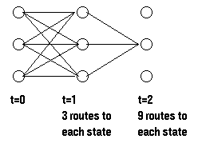

前向算法与后向算法用来计算**观测序列**概率$$P(O|\lambda)$$, 即以当前的HMM产生指定的观测序列$$O$$的概率.

## 前向算法

- **前向概率/部分概率**: 对于给定的隐马尔可夫模型$$\lambda$$, 定义为$$t$$时刻部分观测序列为$$o_1$$, $$o_2$$, ..., $$o_t$$且当前状态为$$q_i$$的概率. 即在给定观测序列的情况下, $$t$$时刻到达某一中间状态的概率. 记为:

    $$\alpha_t(i)=P(o_1,o_2,...,o_t,i_t=q_i|\lambda), i=1,2,...,N$$
    
- **观测序列概率的前向算法**

    1. 初始状态, 对于每一个状态, 都是直接指定的, 没有路径到达, 因此定义初始状态的前向概率为:
    
        $$\alpha_1(i)=\pi_ib_i(o_1), i=1,2,...,N$$
    
    2. **递推**获得中间某一时刻某个状态下的前向概率. 计算方法如下
    
        $$\alpha_t(i)=P(observation|hidden\ state\ is\ i)*P(all\ paths\ to\ state\ i\ at\ time\ t)$$
        
        前者是从**混淆矩阵**中得到的, 后者表示到达$$t$$时刻状态所经过的**所有可能路径之和**的概率, 如图所示:
        
        
        
        由于我们已经计算得到了$$t$$时刻任一状态的**前向概率**, 因此在计算$$t+1$$时刻的某一状态的前向概率只需要考虑$$t$$时刻就可以了, 因此有递推公式:
        
        $$\alpha_{t+1}(i)=[\sum_{j=1}^{N}\alpha_t(j)a_{ji}]b_i(o_{t+1}), i=1,2,...,N$$
        
        这个式子含义为: 当前观察概率(状态$$i$$下, $$t+1$$时刻所真正看到的观察状态的概率)乘以此时所有到达该状态的概率和(前一时刻所有状态的概率与相应的转移概率的积).
    
    3. **观测序列的概率**
    
        观测序列$$O$$的概率$$P(O|\lambda)$$可以由下式得出:
        
        $$P(O|\lambda)=\sum_{i=1}^{N}\alpha_T(i)$$
        
        即最后的$$T$$时刻所有状态的前向概率之和. 这是由于:
        
        $$\alpha_T(i)=P(o_1,o_2,...,o_T,i_T=q_i|\lambda)$$
        
        因此, 将所有的$$T$$时刻的概率加起来就有
        
        $$P(O|\lambda)=\sum_{i=1}^{N}\alpha_T(i)=P(o_1,o_2,...,o_T|\lambda)$$
        
- **时间复杂度**

    HMM的前向算法的时间复杂度为$$O(N^2T)$$, 其中$$N$$为状态的数量, $$T$$为时序的长度, 前向算法的时间复杂度是$$T$$的**线性级别**.

- **作用**

    前向算法可以用来计算观测序列概率$$P(O|\lambda)$$, 因此如第一节HMM作用的第一条**评估**所说, 根据观测到的序列, 使用不同的已经固定参数的HMM进行评估, 选取观测概率最大的模型. 每个模型都代表着一定的意义, 模型观测序列符合这个HMM代表的某种意义.
