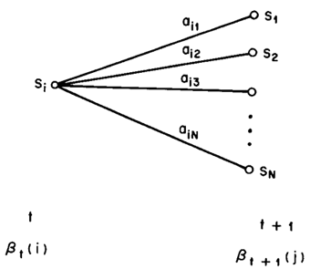

前向算法与后向算法用来计算观测序列概率$$P(O|\lambda)$$, 即以当前的HMM产生指定的观测序列$$O$$的概率.

## 后向算法

- **后向概率**

    对于给定的隐马尔可夫模型$$\lambda$$, 定义为$$t$$时刻状态为$$q_i$$的条件下, 从$$t+1$$时刻到$$T$$时刻的**部分观测序列**为$$o_{t+1}$$, $$o_{t+2}$$, ..., $$o_{T}$$的概率, 记为:
    
    $$\beta_t(i)=P(o_{t+1},o_{t+1},...,o_T|i_t=q_i,\lambda), i=1,2,...,N$$
    
    如同**前向概率**一样, 也可以使用递推的方式求得后向概率$$\beta_t(i)$$以及观测序列概率$$P(O|\lambda)$$. 与前向概率区别的是, 前向的递推是按时间顺序从前向后, 后向的递推是从后向前.
    
- **观测序列概率的后向算法**

    1. 对于$$T$$时刻, 由于后面没有其他的观测序列, 因此规定:
    
        $$\beta_T(i)=1, i=1,2,...,N$$
        
    2. 按时间倒序递推, 即对$$t=T-1,T-2,...,2,1$$
    
        为了计算$$t$$时刻状态为$$q_i$$条件下$$t+1$$时刻的后向概率$$\beta_t(i)$$, 考虑:
        1. $$t+1$$时刻可能的$$N$$个状态$$q_j$$的转移概率, 即$$a_{ij}$$
        2. 在此状态下观测为$$o_{t+1}$$的观测概率, 即$$b_j(o_{t+1})$$
        3. 状态$$q_j$$之后的观测序列的后向概率, 即$$\beta_{t+1}(j)$$
        
        综合逻辑如图所示:
        
        
        
        因此有递推公式:
        
        $$\beta_t(i)=\sum_{j=1}^{N}a_{ij}b_{j}(o_{t+1})\beta_{t+1}(j),i=1,2,...,N$$
        
    3. **观测序列的概率**
        
        观测只需要考虑累加$$t=0$$时刻所有可能状态的后向概率之和就可以. 只是由$$t=0$$时刻(为初始化状态)转向$$t=1$$时刻的过程是用**初始概率**$$\pi_i$$代替**转移概率**.
        
        $$P(O|\lambda)=\sum_{i=1}^{N}\pi_{i}b_{i}(o_1)\beta_1(i)$$
        
- **作用**

    主要是在进行HMM参数学习的前向-后向算法(Forward-backward algorithm)中使用, 是HMM关于学习的应用实现的一部分.