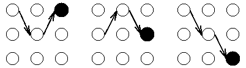
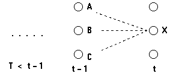

## 目标

多数情况下, 我们都希望能够根据一个给定的HMM模型, 根据观察状态序列找到产生这一序列的潜在的最可能的隐含状态序列.

## 理论

给定一个观察序列和一个隐马尔科夫模型, 我们将考虑递归地寻找最有可能的隐藏状态序列.

首先, 定义局部概率$$\delta$$, 它是到达网格中的**某一个**中间状态时的概率, 它表示的是时刻t时到达某个状态最可能的路径的概率, 而不是所有路径概率的总和.

1. **局部概率**$$\delta$$和**局部最佳途径**
    
    对于网格中的每一个中间及终止状态, 都有一个到达该状态的最可能路径. 举例来说, 在$$t=3$$时刻的3个状态中的每一个都有一个到达此状态的最可能路径, 或许是这样的:
    
    
    
    我们称这些路径局部最佳路径, 其中每个局部最佳路径都有一个相关联的概率, 即**局部概率**$$\delta$$. $$\delta$$是到达该(**中间某一个**)状态最可能的一条路径的概率.
    
    因而$$\delta_{t}(i)$$是$$t$$时刻到达状态$$i$$的所有序列概率中最大的概率, 而局部最佳路径是得到此最大概率的隐藏状态序列.
    
    特别地, 在$$t=T$$时刻每一个状态都有一个局部概率和一个局部最佳路径, 这样我们就可以通过选择此时刻包含最大局部概率的状态及其相应的局部最佳路径来确定全局最佳路径(最佳隐藏状态序列).
    
2. $$t=1$$时刻的局部概率$$\delta_{1}(i)$$
    
    当$$t=1$$时刻, 到达某状态的最可能路径明显是不存在的. 但是, 我们使用$$t=1$$时刻的所处状态的初始概率及相应的观察状态$$o_1$$的观察概率, 计算局部概率$$\delta$$, 即有:
    
    $$\delta_{1}(i)=\pi_ib_i(o_1), i=1,2,\cdots,N$$

3. $$t>1$$时刻的局部概率$$\delta_{t}(i)$$
    
    考虑如下的网格:

    
    
    我们考虑计算$$t$$时刻到达状态$$X$$的最可能的路径, 这条到达状态$$X$$的路径将通过$$t-1$$时刻的状态$$A,B,C$$中的某一个, 因此, 最可能的到达状态$$X$$的路径将是下面这些路径的某一个:
    
    1. 状态序列$$,\cdots,A,X$$
    2. 状态序列$$,\cdots,B,X$$
    3. 状态序列$$,\cdots,C,X$$
    
    想找到路径末端是$$AX,BX,CX$$并且拥有最大概率的路径.
    
    路径末端是$$AX$$的最可能的路径将是: **到达$$A$$的最可能路径再紧跟$$X$$**, 这条路径的概率将是:
    
    **Pr(到达状态A最可能的路径) * Pr (X|A) * Pr (观察状态|X)**
    
    即有递推公式, 对$$t=2,3,\cdots,T$$
    
    $$\delta_{t}(i)=\max_{1\leq{j}\leq{N}}[\delta_{t-1}(j)a_{ji}]b_i(o_t), i=1,2,\cdots,N$$
    
4. 反向指针$$\psi$$
    
    在每一个中间及终止状态我们都知道了局部概率$$\delta_{t}(i)$$, 然而我们的目标是在给定一个观察序列的情况下寻找网格中最可能的隐藏状态序列. 因此, 需要一些方法来**记住网格中的局部最佳路径**.
    
    计算$$t$$时刻的$$\delta_{t}(i)$$我们仅仅需要知道$$t-1$$时刻的$$\delta_{t-1}(j)$$, 在这个局部概率计算之后, 就有可能记录前一时刻哪个状态生成了$$\delta_{t}(i)$$. 也就是说, 在$$t-1$$时刻统必须处于某个状态, 该状态导致了系统在$$t$$时刻到达状态$$i$$是最优的. 这种记录是通过对每一个状态赋予一个反向指针$$\psi_{t}(i)$$完成的, **这个指针指向最优的引发当前状态的前一时刻的某个状态**.
    
    我们可以写成如下的公式:

    $$\psi_{t}(i)=\arg\max_{1\leq{j}\leq{N}}[\delta_{t-1}(j)a_{ji}]$$
    
    特殊地, 对于$$t=1$$时刻, 令:
    
    $$\psi_{1}(i)=0, i=1,2,\cdots,N$$
    
5. 小结
    
    在使用时, 维特比算法对于网格中的每一个单元(某时间某状态)都计算一个局部概率, 同时包括一个反向指针用来指示最可能的到达该单元的路径. 当完成整个计算过程后, 首先在终止时刻找到最可能的状态, 然后通过反向指针回溯到$$t=1$$时刻, 这样回溯路径上的状态序列就是最可能的隐藏状态序列了.

## 整体过程

**输入**: 模型$$\lambda=(A,B,\pi)$$和观测$$O=(o_1,o_2,...,o_T)$$;

**输出**: 最优路径$$I^*=(i^*_1,i^*_2,\cdots,i^*_T)$$.

1. 初始化

    $$\delta_{1}(i)=\pi_ib_i(o_1), i=1,2,\cdots,N$$
    
    $$\psi_{1}(i)=0, i=1,2,\cdots,N$$
    
2. 递推, 对$$t=2,3,\cdots,T$$
    
    $$\delta_{t}(i)=\max_{1\leq{j}\leq{N}}[\delta_{t-1}(j)a_{ji}]b_i(o_t), i=1,2,\cdots,N$$
    
    $$\psi_{t}(i)=\arg\max_{1\leq{j}\leq{N}}[\delta_{t-1}(j)a_{ji}], i=1,2,\cdots,N$$
    
3. 终止
    
    $$P^*=\max_{1\leq{i}\leq{N}}\delta_{T}(i)$$
    
    $$i^*_T=\arg\max_{1\leq{i}\leq{N}}[\delta_{T}(i)]$$

4. 最优路径回溯, 对$$t=T-1,T-2,\cdots,1$$
    
    $$i^*_t=\psi_{t+1}(i^*_{t+1})$$

得到最优路径$$I^*=(i^*_1,i^*_2,\cdots,i^*_T)$$.
