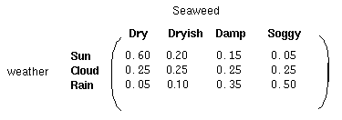

## 马尔科夫过程

**马尔科夫假设**: 当前的状态只依赖于之前的状态, 这种假设被称为马尔科夫假设.

**马尔科夫过程**: 对于一个**离散**随机过程, 如果当前的状态只与前$$n$$个状态相关, 换句话说, 每个状态的转移只依赖于之前的$$n$$个状态, 这个过程被称为**N阶马尔科夫模型**. 最简单的马尔科夫模型就是当$$n=1$$时的模型, 即每个状态只与它之前的一个状态相关. 一阶马尔科夫模型的数学表达如下:

其中, $$X_0$$, $$X_1$$, ..., $$X_n$$被称为**马尔可夫链**, 指一段随机变量序列. 这些变量的所有可能的取值集合, 称做**状态空间**. $$X_n$$是在时间$$n$$下的状态, 则符合马尔科夫过程的$$n+1$$时刻的状态$$X_{n+1}$$的条件分布概率仅是$$X_n$$的函数, 如上式, 这个式子也被称为**马尔科夫性质**.

## 隐马尔科夫模型的定义

**故事模式**

比如说天气晴, 多云, 和雨, 我们不能确定下一时刻的天气状态, 但是我们希望能够生成一个模式来得出天气的变化规律. 

我们可以简单的假设当前的天气只与以前的天气情况有关, 这被称为马尔科夫假设. 这是一个大概的估计, 会丢失很多信息.

当一个隐士不能通过直接观察天气状态来预测天气时, 但他有一些水藻. 民间的传说告诉我们水藻的状态与天气有一定的概率关系, 也就是说, 水藻的状态与天气时紧密相关的. 此时, 我们就有两组状态: 观察状态(水藻的状态)和隐含状态(天气状态). 因此, 我们希望得到一个算法可以为隐士通过水藻和马尔科夫过程, 在没有直接观察天气的情况下得到天气的变化情况.

更容易理解的一个应用就是语音识别, 我们的问题定义就是如何通过给出的语音信号预测出原来的文字信息. 在这里, 语音信号就是观察状态, 识别出的文字就是隐含状态.

在任何一种应用中, 观察状态的个数与隐含状态的个数有可能不一样的.

---

隐马尔科夫模型是关于**时序**的**概率模型**. 它由两部分组成:

1. 隐藏的马尔可夫链随机生成**不可观测**的状态随机序列, 对这个状态序列的预测是我们最后想要的结果.
2. 可观测而产生观测随机序列, 这个观测序列的状态又与隐藏的马尔可夫链的状态概率相关.

隐藏的马尔可夫链随机生成的状态的序列称为**状态序列**; 每个状态生成一种观测(内部隐含关系, 假设出来的), 由此产生的观测的随机序列称为**观测序列**. 序列的每个位置又可以看作一个时刻.

假设时间长度为$$T$$, $$I$$为状态序列, $$O$$为对应的观测序列:

$$I=(i_1,i_2,...,i_T)$$

$$O=(o_1,o_2,...,o_T)$$

对于两个状态序列中每个元素的取值, 有:

$$Q=\{q_1,q_2,...,q_N\}$$

$$V=\{v_1,v_2,...,v_M\}$$

$$Q$$是所有可能的状态的集合, 共有$$N$$种. $$V$$是所有可能的观测的集合, 共有$$M$$种.

首先, 对于状态序列, 由于是一个马尔科夫过程, 共有$$N$$种状态, 那么就有$$N*N$$个状态转移, 每个状态转移都有一定的**转移概率**, 因此对于**状态序列**, 存在一个**状态转移矩阵**$$A=[a_{ij}]_{N*N}$$, 如下图:

然后, 对于给定的马尔科夫过程, 一个特定的隐状态以不同的概率对应着所有观测状态, 因此, 又有一个**状态与观测之间**的**观测概率矩阵**$$B=[b_{j}(k)]_{N*M}$$.

其中, $$b_{j}(k)=P(o_t=v_k|i_t=q_j), k=1,2,...,M;j=1,2,...,N$$, 是$$t$$时刻处于状态$$q_j$$条件下生成观测$$v_k$$的概率.

最后, 为了初始化系统, 让系统状态转移运动起来, 给定一个**初始状态概率向量**$$\pi=(\pi_i)$$.

其中, $$\pi_i=P(i_1=q_i), i=1,2,...,N$$为时刻$$t=1$$处于状态$$q_i$$的概率, 向量长度为状态的总数量$$N$$.

---

对于之前的天气与海藻结合的HMM模型, 转移图如下

其中状态转移矩阵如下:

观测概率矩阵如下:

初始状态概率向量如下:

---

以上就是HMM的所有要素:

- 两类状态
    - 隐状态(状态序列)
    - 观测状态(观测序列)
- 三组概率
    - 初始状态概率向量
    - 状态转移概率矩阵
    - 观测概率矩阵(混淆矩阵)

其中状态转移概率矩阵和观测概率矩阵(混淆矩阵)在整个系统中是一成不变的. **这也是HMM中最不切实际的假设**.

隐马尔可夫模型由初始状态概率向量$$\pi$$, 状态转移概率矩阵$$A$$和观测概率矩阵$$B$$决定. 其中$$\pi$$和$$A$$决定状态序列, $$B$$决定观测序列, 隐马模型$$\lambda$$可以用三元符合表示,即

$$\lambda=(A,B,\pi)$$

**隐马尔可夫模型作了三个假设**
1. 齐次马尔科夫性假设, 隐藏的马尔可夫链在任意时刻$$t$$的状态只依赖与其前一时刻的状态, 与$$t$$时刻无关, 也与其他时刻的**状态**和**观测**无关.

    $$P(i_t|i_{t-1},...,i_{1},o_{t-1},...,o_{1})=P(i_t|i_{t-1}), t=1,2,...,T$$

2. 观测独立性假设, 任意时刻的观测只依赖于该时刻的马尔可夫链的状态, 与其他**观测**以及**状态**无关.

    $$P(o_t|i_{T},...,i_{1},o_{T},...,o_{t+1},o_{t-1},...,o_{1})=P(o_t|i_{t})$$

3. 状态转移概率矩阵和观测概率矩阵(混淆矩阵)在整个系统中是一成不变的.

## 隐马尔可夫模型的应用

1. 评估
    
    **根据已知的HMM找出一个观察序列的概率**. 假设我们有一系列的HMM模型, 来描述不同的系统(比如夏天的天气变化规律和冬天的天气变化规律), 我们想知道哪个系统生成观察状态序列的概率最大. 把不同季节的天气系统应用到一个给定的观察状态序列上, 得到概率最大的哪个系统所对应的季节就是最有可能出现的季节, 在语音识别中也有同样的应用.
    
    我们会用**forward algorithm**算法来得到观察状态序列对应于一个HMM的概率.
    
2. 解码/标注
    
    **根据观察序列找到最有可能出现的隐状态序列**. 回想水藻和天气的例子, 一个盲人隐士只能通过感受水藻的状态来判断天气状况. 我们使用**viterbi algorithm**来解决这类问题.
    
    **Viterbi算法**也被广泛的应用在自然语言处理领域, 比如词性标注. 字面上的文字信息就是观察状态, 而词性就是隐状态. 通过HMM我们就可以找到一句话上下文中最有可能出现的句法结构.

3. 学习
    
    **从观察序列中得出HMM**. 这是最难的HMM应用. 也就是根据观察序列和其代表的隐状态, 生成一个三元组$$\lambda=(A,B,\pi)$$. 使这个三元组能够最好的描述我们所见的一个现象规律.
    
    我们用**forward-backward algorithm**来解决在现实中经常出现的问题–转移矩阵和混淆矩阵不能直接得到的情况.
